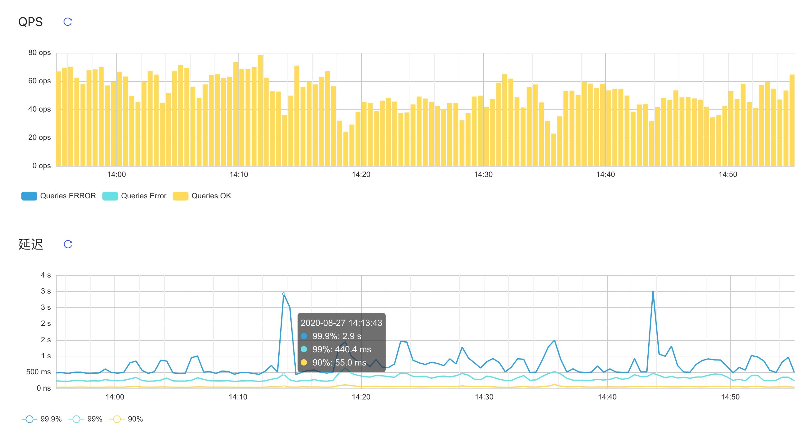
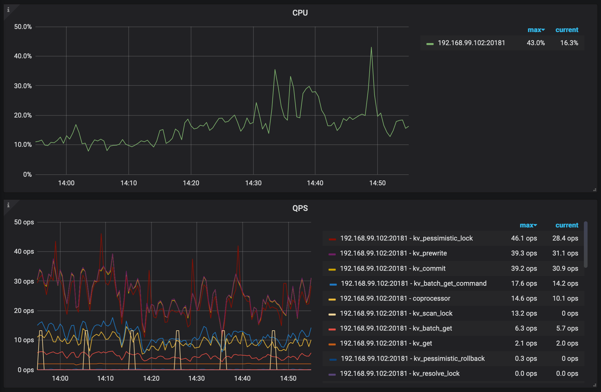
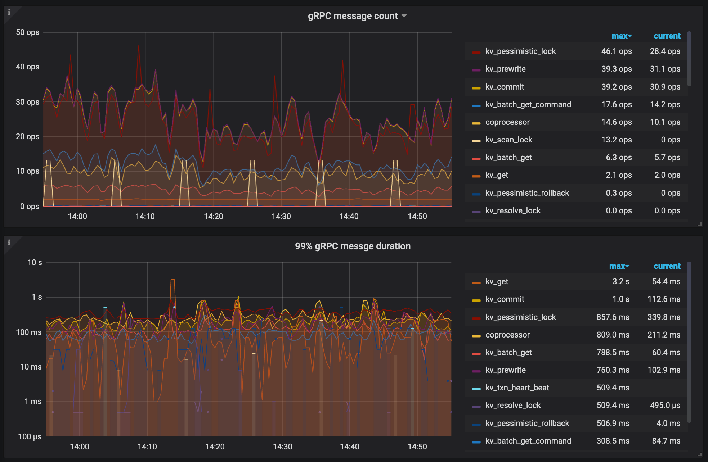
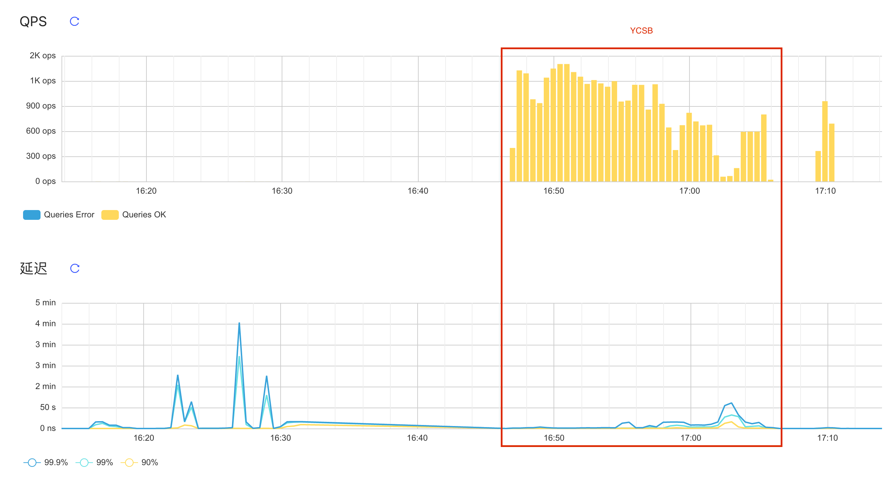
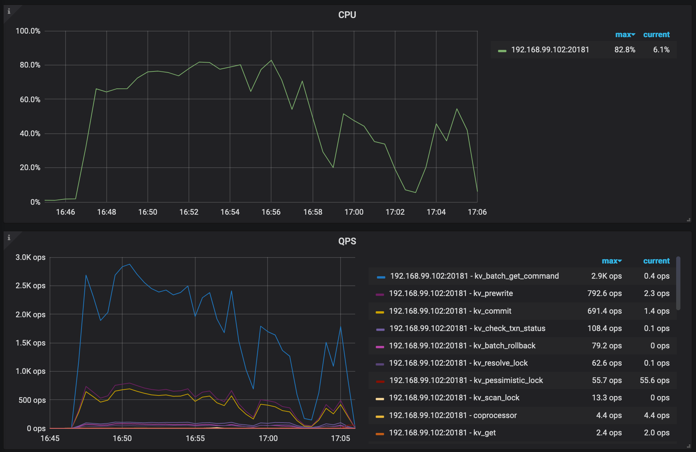
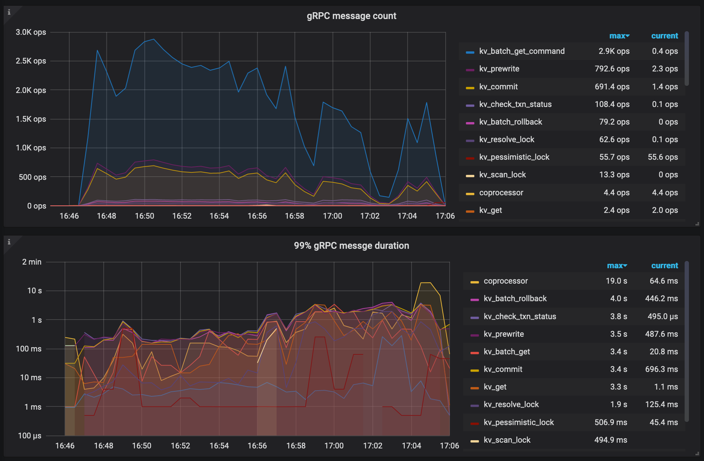

# 高性能TiDB课程作业（第二周）

分值：300题目描述：

使用 sysbench、go-ycsb 和 go-tpc 分别对 TiDB 进行测试并且产出测试报告。测试报告需要包括以下内容：

1. 部署环境的机器配置(CPU、内存、磁盘规格型号)，拓扑结构(TiDB、TiKV 各部署于哪些节点)
2. 调整过后的 TiDB 和 TiKV 配置
3. 测试输出结果
    - 关键指标的监控截图
    - TiDB Query Summary 中的 qps 与 duration
    - TiKV Details 面板中 Cluster 中各 server 的 CPU 以及 QPS 指标
    - TiKV Details 面板中 grpc 的 qps 以及 duration输出：

写出你对该配置与拓扑环境和 workload 下 TiDB 集群负载的分析，提出你认为的 TiDB 的性能的瓶颈所在(能提出大致在哪个模块即 可)截止时间：下周二（8.25）24:00:00(逾期提交不给分)

## 1. 机器配置

- CPU 3.1 GHz 四核Intel Core i5
- 内存 16 GB 1867 MHz DDR3
- 磁盘规格型号 APPLE HDD HTS541010A9E662 1 TB 5400 RPM

## 2. 拓扑结构

| IP地址             | 角色                  | 操作系统        | 核数          | 内存|
| ---               | ---                   | ---           | ---           | ---|
| 192.168.99.101    | TiDB Server           | CentOS 8.3.1  | 1vCPU         | 2GB|
| 192.168.99.102    | TiKV Server           | CentOS 8.3.1  | 4vCPU         | 4GB|
| 192.168.99.103    | PD Server             | CentOS 8.3.1  | 1vCPU         | 1GB|
| 192.168.99.103    | Prometheus Server     | -             | -             | -  |
| 192.168.99.103    | Grafana Server        | -             | -             | -  |
| 192.168.99.103    | Alertmanager Server   | -             | -             | -  |

```bash
# 初始化集群部署环境
tiup cluster deploy tidb-cluster-1 v4.0.0  topo.yaml -u root -p
# 开始部署
tiup cluster start tidb-cluster-1
# 检查集群的结点状态
tiup cluster display tidb-cluster-1
```

### 2.1 TiDB&TiKV服务器配置

```yaml
server_configs:
  tidb:
    log.slow-threshold: 300
    binlog.enable: false
    binlog.ignore-error: false
  tikv:
    server.grpc-concurrency: 2
    rocksdb.max-background-jobs: 4
    raftdb.max-background-jobs: 4
    readpool.unified.max-thread-count: 3
    readpool.storage.use-unified-pool: false
    readpool.coprocessor.use-unified-pool: true
```

### 2.2 集群状态

> tidb Cluster: tidb-cluster-1
>
> tidb Version: v4.0.0

| ID                    |Role           |Host             |Ports         | OS/Arch       | Status      | Data Dir                      | Deploy Dir|
| --                    | ----          | ----            | -----        | -------       | ------      | --------                      | ----------|
| 192.168.99.103:9093   | alertmanager  | 192.168.99.103  | 9093/9094    | linux/x86_64  | Up          | /tidb-data/alertmanager-9093  | /tidb-deploy/alertmanager-9093|
| 192.168.99.103:3000   | grafana       | 192.168.99.103  | 3000         | linux/x86_64  | activating  | -                             | /tidb-deploy/grafana-3000|
| 192.168.99.103:2379   | pd            | 192.168.99.103  | 2379/2380    | linux/x86_64  | Up\|L\|UI   | /tidb-data/pd-2379            | /tidb-deploy/pd-2379|
| 192.168.99.103:9090   | prometheus    | 192.168.99.103  | 9090         | linux/x86_64  | activating  | /tidb-data/prometheus-9090    | /tidb-deploy/prometheus-9090|
| 192.168.99.101:4000   | tidb          | 192.168.99.101  | 4000/10080   | linux/x86_64  | Up          | -                             | /tidb-deploy/tidb-4000|
| 192.168.99.102:20160  | tikv          | 192.168.99.102  | 20160/20181  | linux/x86_64  | Up          | /tidb-data/tikv-20160         | /tidb-deploy/tikv-20160|

## 3. Sysbench压力测试

### 3.1 产生数据集

```bash
sysbench --config-file=sysbench.conf oltp_point_select --tables=32 --table-size=1000000 prepare
```

### 3.2 输出结果

```bash
sysbench --config-file=sysbench.conf oltp_point_select --tables=32 --table-size=1000000 run
```

> sysbench 1.0.20 (using bundled LuaJIT 2.1.0-beta2)
> 
> Running the test with following options:
> Number of threads: 8
> Report intermediate results every 10 second(s)
> Initializing random number generator from current time
> 
> 
> Initializing worker threads...
> 
> Threads started!
> 
> \[ 10s \] thds: 8 tps: 73.05 qps: 73.05 \(r/w/o: 73.05/0.00/0.00\) lat \(ms,95%\): 248.83 err/s: 0.00 reconn/s: 0.00
>
> \[ 20s \] thds: 8 tps: 104.13 qps: 104.13 \(r/w/o: 104.13/0.00/0.00\) lat \(ms,95%\): 211.60 err/s: 0.00 reconn/s: 0.00
>
> \[ 30s \] thds: 8 tps: 190.98 qps: 190.98 \(r/w/o: 190.98/0.00/0.00\) lat \(ms,95%\): 130.13 err/s: 0.00 reconn/s: 0.00
>
> \[ 40s \] thds: 8 tps: 267.32 qps: 267.32 \(r/w/o: 267.32/0.00/0.00\) lat \(ms,95%\): 97.55 err/s: 0.00 reconn/s: 0.00
>
> \[ 50s \] thds: 8 tps: 283.08 qps: 283.08 \(r/w/o: 283.08/0.00/0.00\) lat \(ms,95%\): 104.84 err/s: 0.00 reconn/s: 0.00
>
> \[ 60s \] thds: 8 tps: 245.73 qps: 245.73 \(r/w/o: 245.73/0.00/0.00\) lat \(ms,95%\): 108.68 err/s: 0.00 reconn/s: 0.00
>
> SQL statistics:
>     queries performed:
>         read:                            11651
>         write:                           0
>         other:                           0
>         total:                           11651
>     transactions:                        11651  (194.02 per sec.)
>     queries:                             11651  (194.02 per sec.)
>     ignored errors:                      0      (0.00 per sec.)
>     reconnects:                          0      (0.00 per sec.)
> 
> General statistics:
>     total time:                          60.0480s
>     total number of events:              11651
> 
> Latency (ms):
>          min:                                    0.68
>          avg:                                   41.21
>          max:                                  666.53
>          95th percentile:                      144.97
>          sum:                               480161.51
> 
> Threads fairness:
>     events (avg/stddev):           1456.3750/44.14
>     execution time (avg/stddev):   60.0202/0.01

```bash
sysbench --config-file=sysbench.conf oltp_update_index --tables=32 --table-size=1000000 run
```

> sysbench 1.0.20 (using bundled LuaJIT 2.1.0-beta2)
> 
> Running the test with following options:
> Number of threads: 8
> Report intermediate results every 10 second(s)
> Initializing random number generator from current time
> 
> 
> Initializing worker threads...
> 
> Threads started!
> 
> [ 10s ] thds: 8 tps: 13.99 qps: 13.99 (r/w/o: 0.00/13.99/0.00) lat (ms,95%): 1235.62 err/s: 0.00 reconn/s: 0.00
> 
> [ 20s ] thds: 8 tps: 35.30 qps: 35.30 (r/w/o: 0.00/35.00/0.30) lat (ms,95%): 376.49 err/s: 0.00 reconn/s: 0.00
> 
> [ 30s ] thds: 8 tps: 43.01 qps: 43.01 (r/w/o: 0.00/42.71/0.30) lat (ms,95%): 344.08 err/s: 0.00 reconn/s: 0.00
> 
> [ 40s ] thds: 8 tps: 44.80 qps: 44.80 (r/w/o: 0.00/44.50/0.30) lat (ms,95%): 262.64 err/s: 0.00 reconn/s: 0.00
> 
> [ 50s ] thds: 8 tps: 50.00 qps: 50.00 (r/w/o: 0.00/49.80/0.20) lat (ms,95%): 235.74 err/s: 0.00 reconn/s: 0.00
> 
> [ 60s ] thds: 8 tps: 39.00 qps: 39.00 (r/w/o: 0.00/38.80/0.20) lat (ms,95%): 397.39 err/s: 0.00 reconn/s: 0.00
> 
> SQL statistics:
>     queries performed:
>         read:                            0
>         write:                           2256
>         other:                           13
>         total:                           2269
>     transactions:                        2269   (37.80 per sec.)
>     queries:                             2269   (37.80 per sec.)
>     ignored errors:                      0      (0.00 per sec.)
>     reconnects:                          0      (0.00 per sec.)
> 
> General statistics:
>     total time:                          60.0301s
>     total number of events:              2269
> 
> Latency (ms):
>          min:                                    1.86
>          avg:                                  211.62
>          max:                                 1462.21
>          95th percentile:                      458.96
>          sum:                               480177.05
> 
> Threads fairness:
>     events (avg/stddev):           283.6250/1.80
>     execution time (avg/stddev):   60.0221/0.00

```bash
sysbench --config-file=sysbench.conf oltp_read_only --tables=32 --table-size=1000000 run
```

> sysbench 1.0.20 (using bundled LuaJIT 2.1.0-beta2)
> 
> Running the test with following options:
> Number of threads: 8
> Report intermediate results every 10 second(s)
> Initializing random number generator from current time
> 
> 
> Initializing worker threads...
> 
> Threads started!
> 
> [ 10s ] thds: 8 tps: 21.69 qps: 353.30 (r/w/o: 309.13/0.00/44.18) lat (ms,95%): 694.45 err/s: 0.00 reconn/s: 0.00
> 
> [ 20s ] thds: 8 tps: 21.90 qps: 352.28 (r/w/o: 308.49/0.00/43.80) lat (ms,95%): 657.93 err/s: 0.00 reconn/s: 0.00
> 
> [ 30s ] thds: 8 tps: 24.70 qps: 392.63 (r/w/o: 343.23/0.00/49.40) lat (ms,95%): 634.66 err/s: 0.00 reconn/s: 0.00
> 
> [ 40s ] thds: 8 tps: 19.01 qps: 305.40 (r/w/o: 267.59/0.00/37.81) lat (ms,95%): 1170.65 err/s: 0.00 reconn/s: 0.00
> 
> [ 50s ] thds: 8 tps: 19.50 qps: 312.70 (r/w/o: 273.50/0.00/39.20) lat (ms,95%): 960.30 err/s: 0.00 reconn/s: 0.00
> 
> [ 60s ] thds: 8 tps: 22.70 qps: 359.74 (r/w/o: 314.35/0.00/45.39) lat (ms,95%): 634.66 err/s: 0.00 reconn/s: 0.00
> 
> SQL statistics:
>     queries performed:
>         read:                            18242
>         write:                           0
>         other:                           2606
>         total:                           20848
>     transactions:                        1303   (21.63 per sec.)
>     queries:                             20848  (346.08 per sec.)
>     ignored errors:                      0      (0.00 per sec.)
>     reconnects:                          0      (0.00 per sec.)
> 
> General statistics:
>     total time:                          60.2387s
>     total number of events:              1303
> 
> Latency (ms):
>          min:                                   24.14
>          avg:                                  369.25
>          max:                                 2108.32
>          95th percentile:                      746.32
>          sum:                               481133.17
> 
> Threads fairness:
>     events (avg/stddev):           162.8750/3.92
>     execution time (avg/stddev):   60.1416/0.07

### 3.3 TiDB query summary QPS&duration


### 3.4 TiKV details server's CPU&QPS


### 3.5 TiKV details GRPC's QPS&duration


## 3.6 结论

三种负载的主要瓶颈都在TiKV结点的IO上，范围查询密集的场景coprocessor的开销比较大，写密集场景下锁的开销非常大。TiKV结点的CPU资源并没有很好的利用完全，但是内存已经打满。

## 4. TPC

### 4.1 TPC-C

#### 4.1.1 产生数据集

```bash
./bin/go-tpc tpcc -H 192.168.99.101 -P 4000 -D tpcc --warehouses 100 prepare
```

#### 4.1.2 输出结果

```bash
./bin/go-tpc tpcc -H 192.168.99.101 -P 4000 -D tpcc --warehouses 100 run
```

> [Summary] DELIVERY - Takes(s): 87866.1, Count: 15576, TPM: 10.6, Sum(ms): 10987655, Avg(ms): 705, 90th(ms): 1500, 99th(ms): 4000, 99.9th(ms): 16000
>
> [Summary] NEW_ORDER - Takes(s): 87889.3, Count: 175158, TPM: 119.6, Sum(ms): 50628541, Avg(ms): 289, 90th(ms): 512, 99th(ms): 1500, 99.9th(ms): 8000
>
> [Summary] ORDER_STATUS - Takes(s): 87872.1, Count: 15763, TPM: 10.8, Sum(ms): 2335770, Avg(ms): 148, 90th(ms): 256, 99th(ms): 512, 99.9th(ms): 1500
>
> [Summary] PAYMENT - Takes(s): 87887.8, Count: 167654, TPM: 114.5, Sum(ms): 19562679, Avg(ms): 116, 90th(ms): 192, 99th(ms): 1000, 99.9th(ms): 4000
>
> [Summary] PAYMENT_ERR - Takes(s): 87887.8, Count: 1, TPM: 0.0, Sum(ms): 1067, Avg(ms): 1067, 90th(ms): 1500, 99th(ms): 1500, 99.9th(ms): 1500
>
> [Summary] STOCK_LEVEL - Takes(s): 87885.6, Count: 15531, TPM: 10.6, Sum(ms): 4176137, Avg(ms): 268, 90th(ms): 1000, 99th(ms): 2000, 99.9th(ms): 4000
> tpmC: 119.6

#### 4.1.3 TiDB query summary QPS&duration



#### 4.1.4 TiKV details server's CPU&QPS



#### 4.1.5 TiKV details GRPC's QPS&duration



#### 4.1.6 结论

性能瓶颈仍然是在TiKV结点上，KV事务的并发引发了大量的锁开销，引起了TiDB QPS的毛刺。

### 4.2 TPC-H

由于之前的OLTP测试中TiKV在并发事务上表现的不太好，本次测试将修改TiKV结点配置。

#### 4.2.1 修改后的TiKV配置

```yaml
  tikv:
    raftdb.max-background-jobs: 2
    readpool.coprocessor.use-unified-pool: true
    readpool.storage.use-unified-pool: false
    readpool.unified.max-thread-count: 2
    rocksdb.max-background-jobs: 2
    server.grpc-concurrency: 2
    pessimistic-txn.pipelined: true
    backup.num-threads: 1
```

#### 4.2.2 产生数据集

```bash
./bin/go-tpc tpch prepare -H 192.168.99.101 -P 4000 -D tpch --sf 50 --analyze
```

#### 4.2.3 输出结果

```bash
./bin/go-tpc tpch run -H 192.168.99.101 -P 4000 -D tpch --sf 50
```

TiDB down

> [mysql] 2020/08/27 16:40:49 packets.go:36: read tcp 192.168.99.1:63133->192.168.99.101:4000: read: operation timed out
>
> [2020-08-27 16:40:50] execute run failed, err execute query 
>
> select
> 	n_name,
> 	sum(l_extendedprice * (1 - l_discount)) as revenue
>
> from
>
> 	customer,
> 	orders,
> 	lineitem,
> 	supplier,
> 	nation,
> 	region
>
> where
>
> 	c_custkey = o_custkey
> 	and l_orderkey = o_orderkey
> 	and l_suppkey = s_suppkey
> 	and c_nationkey = s_nationkey
> 	and s_nationkey = n_nationkey
> 	and n_regionkey = r_regionkey
> 	and r_name = 'MIDDLE EAST'
> 	and o_orderdate >= '1994-01-01'
> 	and o_orderdate < date_add('1994-01-01', interval '1' year)
>
> group by
>
> 	n_name
>
> order by
>
> 	revenue desc;
>
>  failed invalid connection
>
> Finished
>
> [Summary] Q1: 105.51s
>
> [Summary] Q2: 54.28s
>
> [Summary] Q3: 209.38s
>
> [Summary] Q4: 127.40s

#### 4.2.4 TiDB query summary QPS&duration

TODO

#### 4.2.5 TiKV details server's CPU&QPS

TODO

#### 4.2.6 TiKV details GRPC's QPS&duration

TODO

#### 4.2.7 结论

TODO

## 5. YCSB

### 5.1 产生数据集

```bash
./bin/go-ycsb load mysql -P workloads/workloada -p recordcount=1000000 -p mysql.host=192.168.99.101 -p mysql.port=4000 --threads 256
```

### 5.2 输出结果

```bash
./bin/go-ycsb run mysql -P workloads/workloada -p operationcount=1000000 -p mysql.host=192.168.99.101 -p mysql.port=4000 --threads 256
```

> 
> ***************** properties *****************
> 
> "insertproportion"="0"
> 
> "recordcount"="1000"
> 
> "workload"="core"
> 
> "mysql.port"="4000"
> 
> "dotransactions"="true"
> 
> "updateproportion"="0.5"
> 
> "scanproportion"="0"
> 
> "readallfields"="true"
> 
> "readproportion"="0.5"
> 
> "requestdistribution"="uniform"
> 
> "mysql.host"="192.168.99.101"
> 
> "operationcount"="1000000"
> 
> "threadcount"="256"
> 
> **********************************************
> 
> READ   - Takes(s): 9.7, Count: 6028, OPS: 623.7, Avg(us): 108767, Min(us): 1890, Max(us): 418004, 99th(us): 327000, 99.9th(us): 400000, 99.99th(us): 419000
> 
> UPDATE - Takes(s): 9.2, Count: 6021, OPS: 657.3, Avg(us): 248486, Min(us): 58781, Max(us): 1400723, 99th(us): 780000, 99.9th(us): 965000, 99.99th(us): 1401000
> 
> READ   - Takes(s): 19.7, Count: 13264, OPS: 674.5, Avg(us): 102626, Min(us): 1890, Max(us): 418004, 99th(us): 271000, 99.9th(us): 390000, 99.99th(us): 412000
> 
> UPDATE - Takes(s): 19.2, Count: 13242, OPS: 691.1, Avg(us): 231051, Min(us): 50921, Max(us): 1400723, 99th(us): 717000, 99.9th(us): 955000, 99.99th(us): 1217000
> 
> READ   - Takes(s): 29.7, Count: 20594, OPS: 694.2, Avg(us): 102295, Min(us): 1890, Max(us): 513337, 99th(us): 253000, 99.9th(us): 391000, 99.99th(us): 476000
> 
> UPDATE - Takes(s): 29.2, Count: 20641, OPS: 707.8, Avg(us): 235392, Min(us): 34769, Max(us): 1400723, 99th(us): 704000, 99.9th(us): 1001000, 99.99th(us): 1242000
> 
> READ   - Takes(s): 39.7, Count: 28244, OPS: 712.1, Avg(us): 101971, Min(us): 1890, Max(us): 513337, 99th(us): 244000, 99.9th(us): 381000, 99.99th(us): 476000
> 
> UPDATE - Takes(s): 39.2, Count: 28347, OPS: 723.9, Avg(us): 235113, Min(us): 34769, Max(us): 1426710, 99th(us): 688000, 99.9th(us): 997000, 99.99th(us): 1305000
>
> READ   - Takes(s): 49.7, Count: 35420, OPS: 713.1, Avg(us): 103649, Min(us): 1890, Max(us): 513337, 99th(us): 257000, 99.9th(us): 377000, 99.99th(us): 452000
> 
> UPDATE - Takes(s): 49.2, Count: 35482, OPS: 721.7, Avg(us): 237122, Min(us): 34769, Max(us): 1426710, 99th(us): 675000, 99.9th(us): 989000, 99.99th(us): 1242000
> 
> READ   - Takes(s): 59.7, Count: 41606, OPS: 697.3, Avg(us): 106926, Min(us): 1890, Max(us): 513337, 99th(us): 269000, 99.9th(us): 379000, 99.99th(us): 452000
> 
> UPDATE - Takes(s): 59.2, Count: 41527, OPS: 701.9, Avg(us): 245916, Min(us): 34769, Max(us): 1426710, 99th(us): 701000, 99.9th(us): 1026000, 99.99th(us): 1325000
> 
> READ   - Takes(s): 69.7, Count: 46728, OPS: 670.7, Avg(us): 111276, Min(us): 1890, Max(us): 779333, 99th(us): 306000, 99.9th(us): 458000, 99.99th(us): 744000
>
> .....
> 
> READ   - Takes(s): 969.7, Count: 457747, OPS: 472.1, Avg(us): 126287, Min(us): 1560, Max(us): 17326018, 99th(us): 393000, 99.9th(us): 2695000, 99.99th(us): 16540000
> 
> UPDATE - Takes(s): 969.2, Count: 458136, OPS: 472.7, Avg(us): 408683, Min(us): 4162, Max(us): 58579537, 99th(us): 2603000, 99.9th(us): 13993000, 99.99th(us): 21713000
> 
> UPDATE_ERROR - Takes(s): 68.7, Count: 1, OPS: 0.0, Avg(us): 23412009, Min(us): 23412009, Max(us): 23412009, 99th(us): 23413000, 99.9th(us): 23413000, 99.99th(us): 23413000
> 
> READ   - Takes(s): 979.7, Count: 457886, OPS: 467.4, Avg(us): 129447, Min(us): 1560, Max(us): 18382326, 99th(us): 397000, 99.9th(us): 4815000, 99.99th(us): 17616000
> 
> UPDATE - Takes(s): 979.2, Count: 458212, OPS: 468.0, Avg(us): 412078, Min(us): 4162, Max(us): 58579537, 99th(us): 2632000, 99.9th(us): 14528000, 99.99th(us): 23414000
> 
> UPDATE_ERROR - Takes(s): 78.7, Count: 1, OPS: 0.0, Avg(us): 23412009, Min(us): 23412009, Max(us): 23412009, 99th(us): 23413000, 99.9th(us): 23413000, 99.99th(us): 23413000
> 
> READ   - Takes(s): 989.7, Count: 458769, OPS: 463.6, Avg(us): 130695, Min(us): 1560, Max(us): 18890335, 99th(us): 406000, 99.9th(us): 4880000, 99.99th(us): 17617000
> 
> UPDATE - Takes(s): 989.2, Count: 459169, OPS: 464.2, Avg(us): 419432, Min(us): 4162, Max(us): 58579537, 99th(us): 2749000, 99.9th(us): 15446000, 99.99th(us): 28766000
> 
> UPDATE_ERROR - Takes(s): 88.7, Count: 1, OPS: 0.0, Avg(us): 23412009, Min(us): 23412009, Max(us): 23412009, 99th(us): 23413000, 99.9th(us): 23413000, 99.99th(us): 23413000
> 
> READ   - Takes(s): 999.7, Count: 458971, OPS: 459.1, Avg(us): 131886, Min(us): 1560, Max(us): 18890335, 99th(us): 409000, 99.9th(us): 10136000, 99.99th(us): 17616000
> 
> UPDATE - Takes(s): 999.2, Count: 459384, OPS: 459.8, Avg(us): 423092, Min(us): 4162, Max(us): 58579537, 99th(us): 2809000, 99.9th(us): 15447000, 99.99th(us): 28766000
> 
> UPDATE_ERROR - Takes(s): 98.7, Count: 1, OPS: 0.0, Avg(us): 23412009, Min(us): 23412009, Max(us): 23412009, 99th(us): 23413000, 99.9th(us): 23413000, 99.99th(us): 23413000
> 
> READ   - Takes(s): 1009.7, Count: 462538, OPS: 458.1, Avg(us): 131678, Min(us): 1560, Max(us): 18890335, 99th(us): 408000, 99.9th(us): 9412000, 99.99th(us): 17616000
> 
> UPDATE - Takes(s): 1009.2, Count: 463007, OPS: 458.8, Avg(us): 425321, Min(us): 4162, Max(us): 58579537, 99th(us): 2891000, 99.9th(us): 15443000, 99.99th(us): 28303000
> 
> UPDATE_ERROR - Takes(s): 108.7, Count: 1, OPS: 0.0, Avg(us): 23412009, Min(us): 23412009, Max(us): 23412009, 99th(us): 23413000, 99.9th(us): 23413000, 99.99th(us): 23413000
> 
> READ   - Takes(s): 1019.7, Count: 467226, OPS: 458.2, Avg(us): 131419, Min(us): 1560, Max(us): 18890335, 99th(us): 408000, 99.9th(us): 8897000, 99.99th(us): 17616000
> 
> UPDATE - Takes(s): 1019.2, Count: 467587, OPS: 458.8, Avg(us): 425521, Min(us): 4162, Max(us): 58579537, 99th(us): 2881000, 99.9th(us): 15431000, 99.99th(us): 28303000
> 
> UPDATE_ERROR - Takes(s): 118.7, Count: 1, OPS: 0.0, Avg(us): 23412009, Min(us): 23412009, Max(us): 23412009, 99th(us): 23413000, 99.9th(us): 23413000, 99.99th(us): 23413000
> 
> READ   - Takes(s): 1029.7, Count: 470697, OPS: 457.1, Avg(us): 130996, Min(us): 1560, Max(us): 18890335, 99th(us): 408000, 99.9th(us): 8889000, 99.99th(us): 17616000
> 
> UPDATE - Takes(s): 1029.2, Count: 471082, OPS: 457.7, Avg(us): 427177, Min(us): 4162, Max(us): 58579537, 99th(us): 2871000, 99.9th(us): 15420000, 99.99th(us): 26555000
> 
> UPDATE_ERROR - Takes(s): 128.7, Count: 1, OPS: 0.0, Avg(us): 23412009, Min(us): 23412009, Max(us): 23412009, 99th(us): 23413000, 99.9th(us): 23413000, 99.99th(us): 23413000
> 
> READ   - Takes(s): 1039.7, Count: 475269, OPS: 457.1, Avg(us): 130702, Min(us): 1560, Max(us): 18890335, 99th(us): 409000, 99.9th(us): 8871000, 99.99th(us): 17616000
> 
> UPDATE - Takes(s): 1039.2, Count: 475580, OPS: 457.7, Avg(us): 427651, Min(us): 4162, Max(us): 58579537, 99th(us): 2869000, 99.9th(us): 15405000, 99.99th(us): 26281000
> 
> UPDATE_ERROR - Takes(s): 138.7, Count: 1, OPS: 0.0, Avg(us): 23412009, Min(us): 23412009, Max(us): 23412009, 99th(us): 23413000, 99.9th(us): 23413000, 99.99th(us): 23413000
> 
> READ   - Takes(s): 1049.7, Count: 479363, OPS: 456.7, Avg(us): 130489, Min(us): 1560, Max(us): 18890335, 99th(us): 408000, 99.9th(us): 8816000, 99.99th(us): 17616000
> 
> UPDATE - Takes(s): 1049.2, Count: 479527, OPS: 457.1, Avg(us): 428075, Min(us): 4162, Max(us): 58579537, 99th(us): 2855000, 99.9th(us): 15384000, 99.99th(us): 26555000
> 
> UPDATE_ERROR - Takes(s): 148.7, Count: 1, OPS: 0.0, Avg(us): 23412009, Min(us): 23412009, Max(us): 23412009, 99th(us): 23413000, 99.9th(us): 23413000, 99.99th(us): 23413000
> 
> READ   - Takes(s): 1059.7, Count: 479790, OPS: 452.8, Avg(us): 130785, Min(us): 1560, Max(us): 18890335, 99th(us): 412000, 99.9th(us): 8816000, 99.99th(us): 17616000
> 
> UPDATE - Takes(s): 1059.2, Count: 479853, OPS: 453.0, Avg(us): 430886, Min(us): 4162, Max(us): 58579537, 99th(us): 2950000, 99.9th(us): 15384000, 99.99th(us): 26555000
> 
> UPDATE_ERROR - Takes(s): 158.7, Count: 1, OPS: 0.0, Avg(us): 23412009, Min(us): 23412009, Max(us): 23412009, 99th(us): 23413000, 99.9th(us): 23413000, 99.99th(us): 23413000
> 
> READ   - Takes(s): 1069.7, Count: 482178, OPS: 450.8, Avg(us): 130924, Min(us): 1560, Max(us): 18890335, 99th(us): 419000, 99.9th(us): 6339000, 99.99th(us): 17616000
> 
> UPDATE - Takes(s): 1069.2, Count: 482218, OPS: 451.0, Avg(us): 435345, Min(us): 4162, Max(us): 58579537, 99th(us): 3083000, 99.9th(us): 15431000, 99.99th(us): 26281000
> 
> UPDATE_ERROR - Takes(s): 168.7, Count: 1, OPS: 0.0, Avg(us): 23412009, Min(us): 23412009, Max(us): 23412009, 99th(us): 23413000, 99.9th(us): 23413000, 99.99th(us): 23413000
> 
> READ   - Takes(s): 1079.7, Count: 483821, OPS: 448.1, Avg(us): 130850, Min(us): 1560, Max(us): 18890335, 99th(us): 425000, 99.9th(us): 6337000, 99.99th(us): 17616000
> 
> UPDATE - Takes(s): 1079.2, Count: 483856, OPS: 448.4, Avg(us): 438714, Min(us): 4162, Max(us): 58579537, 99th(us): 3156000, 99.9th(us): 15429000, 99.99th(us): 26281000
> 
> UPDATE_ERROR - Takes(s): 178.7, Count: 1, OPS: 0.0, Avg(us): 23412009, Min(us): 23412009, Max(us): 23412009, 99th(us): 23413000, 99.9th(us): 23413000, 99.99th(us): 23413000
> 
> READ   - Takes(s): 1089.7, Count: 490720, OPS: 450.3, Avg(us): 129951, Min(us): 1560, Max(us): 18890335, 99th(us): 420000, 99.9th(us): 5594000, 99.99th(us): 17616000
> 
> UPDATE - Takes(s): 1089.2, Count: 490767, OPS: 450.6, Avg(us): 436955, Min(us): 4162, Max(us): 58579537, 99th(us): 3132000, 99.9th(us): 15408000, 99.99th(us): 26213000
> 
> UPDATE_ERROR - Takes(s): 188.7, Count: 1, OPS: 0.0, Avg(us): 23412009, Min(us): 23412009, Max(us): 23412009, 99th(us): 23413000, 99.9th(us): 23413000, 99.99th(us): 23413000
> 
> READ   - Takes(s): 1099.7, Count: 496711, OPS: 451.7, Avg(us): 129034, Min(us): 1560, Max(us): 18890335, 99th(us): 418000, 99.9th(us): 5584000, 99.99th(us): 17616000
> 
> UPDATE - Takes(s): 1099.2, Count: 496690, OPS: 451.9, Avg(us): 434986, Min(us): 4162, Max(us): 58579537, 99th(us): 3113000, 99.9th(us): 15375000, 99.99th(us): 26213000
> 
> UPDATE_ERROR - Takes(s): 198.7, Count: 1, OPS: 0.0, Avg(us): 23412009, Min(us): 23412009, Max(us): 23412009, 99th(us): 23413000, 99.9th(us): 23413000, 99.99th(us): 23413000
> 
> READ   - Takes(s): 1109.7, Count: 499705, OPS: 450.3, Avg(us): 128393, Min(us): 1560, Max(us): 18890335, 99th(us): 416000, 99.9th(us): 5579000, 99.99th(us): 17616000
> 
> UPDATE - Takes(s): 1109.2, Count: 499754, OPS: 450.6, Avg(us): 433311, Min(us): 2738, Max(us): 58579537, 99th(us): 3101000, 99.9th(us): 15324000, 99.99th(us): 26213000
> 
> UPDATE_ERROR - Takes(s): 208.7, Count: 1, OPS: 0.0, Avg(us): 23412009, Min(us): 23412009, Max(us): 23412009, 99th(us): 23413000, 99.9th(us): 23413000, 99.99th(us): 23413000
> 
> Run finished, takes 18m33.190330233s
> 
> READ   - Takes(s): 1112.8, Count: 499947, OPS: 449.3, Avg(us): 128334, Min(us): 1560, Max(us): 18890335, 99th(us): 416000, 99.9th(us): 5579000, 99.99th(us): 17616000
> 
> UPDATE - Takes(s): 1112.3, Count: 499988, OPS: 449.5, Avg(us): 433163, Min(us): 2738, Max(us): 58579537, 99th(us): 3101000, 99.9th(us): 15324000, 99.99th(us): 26213000
> 
> UPDATE_ERROR - Takes(s): 211.8, Count: 1, OPS: 0.0, Avg(us): 23412009, Min(us): 23412009, Max(us): 23412009, 99th(us): 23413000, 99.9th(us): 23413000, 99.99th(us): 23413000

### 5.3 TiDB query summary QPS&duration



### 5.4 TiKV details server's CPU&QPS



### 5.5 TiKV details GRPC's QPS&duration



### 5.6 结论

调整过TiKV配置结点后，磁盘IO和KV事务的表现都好了不少，QPS的下降是由于PD的TSO获取变慢导致。大致来看，TiKV结点的性能开销主要在coprocessor。
