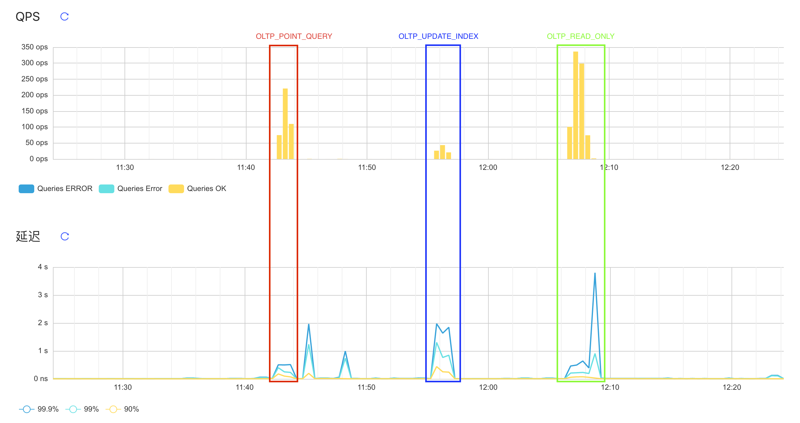
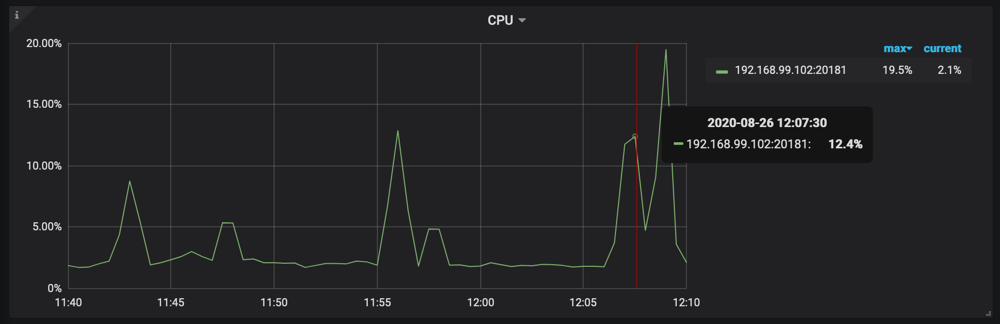
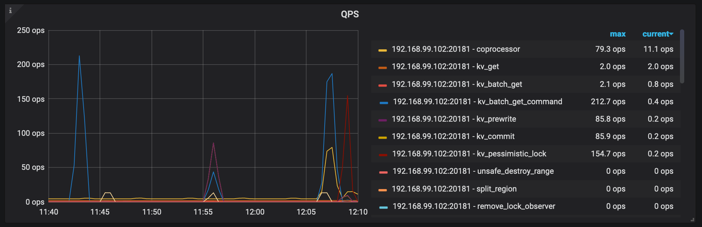
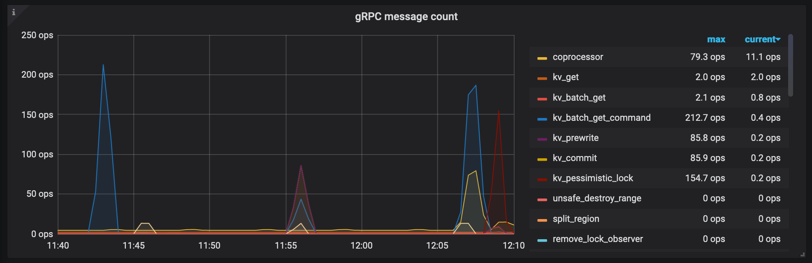
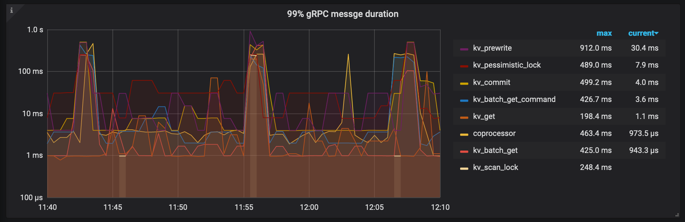

# 高性能TiDB课程作业（第二周）

分值：300题目描述：

使用 sysbench、go-ycsb 和 go-tpc 分别对 TiDB 进行测试并且产出测试报告。测试报告需要包括以下内容：

1. 部署环境的机器配置(CPU、内存、磁盘规格型号)，拓扑结构(TiDB、TiKV 各部署于哪些节点)
2. 调整过后的 TiDB 和 TiKV 配置
3. 测试输出结果
    - 关键指标的监控截图
    - TiDB Query Summary 中的 qps 与 duration
    - TiKV Details 面板中 Cluster 中各 server 的 CPU 以及 QPS 指标
    - TiKV Details 面板中 grpc 的 qps 以及 duration输出：

写出你对该配置与拓扑环境和 workload 下 TiDB 集群负载的分析，提出你认为的 TiDB 的性能的瓶颈所在(能提出大致在哪个模块即 可)截止时间：下周二（8.25）24:00:00(逾期提交不给分)

## 1. 机器配置

- CPU 3.1 GHz 四核Intel Core i5
- 内存 16 GB 1867 MHz DDR3
- 磁盘规格型号 APPLE HDD HTS541010A9E662 1 TB 5400 RPM

## 2. 拓扑结构

| IP地址             | 角色                  | 操作系统        | 核数          | 内存|
| ---               | ---                   | ---           | ---           | ---|
| 192.168.99.101    | TiDB Server           | CentOS 8.3.1  | 1vCPU         | 2GB|
| 192.168.99.102    | TiKV Server           | CentOS 8.3.1  | 4vCPU         | 4GB|
| 192.168.99.103    | PD Server             | CentOS 8.3.1  | 1vCPU         | 1GB|
| 192.168.99.103    | Prometheus Server     | -             | -             | -  |
| 192.168.99.103    | Grafana Server        | -             | -             | -  |
| 192.168.99.103    | Alertmanager Server   | -             | -             | -  |

```bash
# 初始化集群部署环境
tiup cluster deploy tidb-cluster-1 v4.0.0  topo.yaml -u root -p
# 开始部署
tiup cluster start tidb-cluster-1
# 检查集群的结点状态
tiup cluster display tidb-cluster-1
```

### 2.1 TiDB&TiKV服务器配置

```yaml
server_configs:
  tidb:
    log.slow-threshold: 300
    binlog.enable: false
    binlog.ignore-error: false
  tikv:
    server.grpc-concurrency: 2
    rocksdb.max-background-jobs: 4
    raftdb.max-background-jobs: 4
    readpool.unified.max-thread-count: 3
    readpool.storage.use-unified-pool: false
    readpool.coprocessor.use-unified-pool: true
```

### 2.2 集群状态

> tidb Cluster: tidb-cluster-1
>
> tidb Version: v4.0.0

| ID                    |Role           |Host             |Ports         | OS/Arch       | Status      | Data Dir                      | Deploy Dir|
| --                    | ----          | ----            | -----        | -------       | ------      | --------                      | ----------|
| 192.168.99.103:9093   | alertmanager  | 192.168.99.103  | 9093/9094    | linux/x86_64  | Up          | /tidb-data/alertmanager-9093  | /tidb-deploy/alertmanager-9093|
| 192.168.99.103:3000   | grafana       | 192.168.99.103  | 3000         | linux/x86_64  | activating  | -                             | /tidb-deploy/grafana-3000|
| 192.168.99.103:2379   | pd            | 192.168.99.103  | 2379/2380    | linux/x86_64  | Up\|L\|UI   | /tidb-data/pd-2379            | /tidb-deploy/pd-2379|
| 192.168.99.103:9090   | prometheus    | 192.168.99.103  | 9090         | linux/x86_64  | activating  | /tidb-data/prometheus-9090    | /tidb-deploy/prometheus-9090|
| 192.168.99.101:4000   | tidb          | 192.168.99.101  | 4000/10080   | linux/x86_64  | Up          | -                             | /tidb-deploy/tidb-4000|
| 192.168.99.102:20160  | tikv          | 192.168.99.102  | 20160/20181  | linux/x86_64  | Up          | /tidb-data/tikv-20160         | /tidb-deploy/tikv-20160|

## 3. Sysbench压力测试

### 3.1 产生数据集

```bash
sysbench --config-file=sysbench.conf oltp_point_select --tables=32 --table-size=1000000 prepare
```

### 3.2 输出结果

```bash
sysbench --config-file=sysbench.conf oltp_point_select --tables=32 --table-size=1000000 run
```

> sysbench 1.0.20 (using bundled LuaJIT 2.1.0-beta2)
> 
> Running the test with following options:
> Number of threads: 8
> Report intermediate results every 10 second(s)
> Initializing random number generator from current time
> 
> 
> Initializing worker threads...
> 
> Threads started!
> 
> \[ 10s \] thds: 8 tps: 73.05 qps: 73.05 \(r/w/o: 73.05/0.00/0.00\) lat \(ms,95%\): 248.83 err/s: 0.00 reconn/s: 0.00
>
> \[ 20s \] thds: 8 tps: 104.13 qps: 104.13 \(r/w/o: 104.13/0.00/0.00\) lat \(ms,95%\): 211.60 err/s: 0.00 reconn/s: 0.00
>
> \[ 30s \] thds: 8 tps: 190.98 qps: 190.98 \(r/w/o: 190.98/0.00/0.00\) lat \(ms,95%\): 130.13 err/s: 0.00 reconn/s: 0.00
>
> \[ 40s \] thds: 8 tps: 267.32 qps: 267.32 \(r/w/o: 267.32/0.00/0.00\) lat \(ms,95%\): 97.55 err/s: 0.00 reconn/s: 0.00
>
> \[ 50s \] thds: 8 tps: 283.08 qps: 283.08 \(r/w/o: 283.08/0.00/0.00\) lat \(ms,95%\): 104.84 err/s: 0.00 reconn/s: 0.00
>
> \[ 60s \] thds: 8 tps: 245.73 qps: 245.73 \(r/w/o: 245.73/0.00/0.00\) lat \(ms,95%\): 108.68 err/s: 0.00 reconn/s: 0.00
>
> SQL statistics:
>     queries performed:
>         read:                            11651
>         write:                           0
>         other:                           0
>         total:                           11651
>     transactions:                        11651  (194.02 per sec.)
>     queries:                             11651  (194.02 per sec.)
>     ignored errors:                      0      (0.00 per sec.)
>     reconnects:                          0      (0.00 per sec.)
> 
> General statistics:
>     total time:                          60.0480s
>     total number of events:              11651
> 
> Latency (ms):
>          min:                                    0.68
>          avg:                                   41.21
>          max:                                  666.53
>          95th percentile:                      144.97
>          sum:                               480161.51
> 
> Threads fairness:
>     events (avg/stddev):           1456.3750/44.14
>     execution time (avg/stddev):   60.0202/0.01

```bash
sysbench --config-file=sysbench.conf oltp_update_index --tables=32 --table-size=1000000 run
```

> sysbench 1.0.20 (using bundled LuaJIT 2.1.0-beta2)
> 
> Running the test with following options:
> Number of threads: 8
> Report intermediate results every 10 second(s)
> Initializing random number generator from current time
> 
> 
> Initializing worker threads...
> 
> Threads started!
> 
> [ 10s ] thds: 8 tps: 13.99 qps: 13.99 (r/w/o: 0.00/13.99/0.00) lat (ms,95%): 1235.62 err/s: 0.00 reconn/s: 0.00
> 
> [ 20s ] thds: 8 tps: 35.30 qps: 35.30 (r/w/o: 0.00/35.00/0.30) lat (ms,95%): 376.49 err/s: 0.00 reconn/s: 0.00
> 
> [ 30s ] thds: 8 tps: 43.01 qps: 43.01 (r/w/o: 0.00/42.71/0.30) lat (ms,95%): 344.08 err/s: 0.00 reconn/s: 0.00
> 
> [ 40s ] thds: 8 tps: 44.80 qps: 44.80 (r/w/o: 0.00/44.50/0.30) lat (ms,95%): 262.64 err/s: 0.00 reconn/s: 0.00
> 
> [ 50s ] thds: 8 tps: 50.00 qps: 50.00 (r/w/o: 0.00/49.80/0.20) lat (ms,95%): 235.74 err/s: 0.00 reconn/s: 0.00
> 
> [ 60s ] thds: 8 tps: 39.00 qps: 39.00 (r/w/o: 0.00/38.80/0.20) lat (ms,95%): 397.39 err/s: 0.00 reconn/s: 0.00
> 
> SQL statistics:
>     queries performed:
>         read:                            0
>         write:                           2256
>         other:                           13
>         total:                           2269
>     transactions:                        2269   (37.80 per sec.)
>     queries:                             2269   (37.80 per sec.)
>     ignored errors:                      0      (0.00 per sec.)
>     reconnects:                          0      (0.00 per sec.)
> 
> General statistics:
>     total time:                          60.0301s
>     total number of events:              2269
> 
> Latency (ms):
>          min:                                    1.86
>          avg:                                  211.62
>          max:                                 1462.21
>          95th percentile:                      458.96
>          sum:                               480177.05
> 
> Threads fairness:
>     events (avg/stddev):           283.6250/1.80
>     execution time (avg/stddev):   60.0221/0.00

```bash
sysbench --config-file=sysbench.conf oltp_read_only --tables=32 --table-size=1000000 run
```

> sysbench 1.0.20 (using bundled LuaJIT 2.1.0-beta2)
> 
> Running the test with following options:
> Number of threads: 8
> Report intermediate results every 10 second(s)
> Initializing random number generator from current time
> 
> 
> Initializing worker threads...
> 
> Threads started!
> 
> [ 10s ] thds: 8 tps: 21.69 qps: 353.30 (r/w/o: 309.13/0.00/44.18) lat (ms,95%): 694.45 err/s: 0.00 reconn/s: 0.00
> 
> [ 20s ] thds: 8 tps: 21.90 qps: 352.28 (r/w/o: 308.49/0.00/43.80) lat (ms,95%): 657.93 err/s: 0.00 reconn/s: 0.00
> 
> [ 30s ] thds: 8 tps: 24.70 qps: 392.63 (r/w/o: 343.23/0.00/49.40) lat (ms,95%): 634.66 err/s: 0.00 reconn/s: 0.00
> 
> [ 40s ] thds: 8 tps: 19.01 qps: 305.40 (r/w/o: 267.59/0.00/37.81) lat (ms,95%): 1170.65 err/s: 0.00 reconn/s: 0.00
> 
> [ 50s ] thds: 8 tps: 19.50 qps: 312.70 (r/w/o: 273.50/0.00/39.20) lat (ms,95%): 960.30 err/s: 0.00 reconn/s: 0.00
> 
> [ 60s ] thds: 8 tps: 22.70 qps: 359.74 (r/w/o: 314.35/0.00/45.39) lat (ms,95%): 634.66 err/s: 0.00 reconn/s: 0.00
> 
> SQL statistics:
>     queries performed:
>         read:                            18242
>         write:                           0
>         other:                           2606
>         total:                           20848
>     transactions:                        1303   (21.63 per sec.)
>     queries:                             20848  (346.08 per sec.)
>     ignored errors:                      0      (0.00 per sec.)
>     reconnects:                          0      (0.00 per sec.)
> 
> General statistics:
>     total time:                          60.2387s
>     total number of events:              1303
> 
> Latency (ms):
>          min:                                   24.14
>          avg:                                  369.25
>          max:                                 2108.32
>          95th percentile:                      746.32
>          sum:                               481133.17
> 
> Threads fairness:
>     events (avg/stddev):           162.8750/3.92
>     execution time (avg/stddev):   60.1416/0.07

### 3.3 TiDB query summary QPS&duration



### 3.4 TiKV details server's CPU&QPS






### 3.5 TiKV details GRPC's QPS&duration





## 3.6 结论

三种负载的主要瓶颈都在TiKV结点的IO上，范围查询密集的场景coprocessor的开销比较大，写密集场景下锁的开销非常大。TiKV结点的CPU资源并没有很好的利用完全，但是内存已经打满。

## 4. TPC

### 4.1 TPC-C

#### 4.1.1 产生数据集

```bash
./bin/go-tpc tpcc -H 192.168.99.101 -P 4000 -D tpcc --warehouses 100 prepare
```

#### 4.1.2 输出结果

```bash
./bin/go-tpc tpcc -H 192.168.99.101 -P 4000 -D tpcc --warehouses 100 run
```

#### 4.1.3 TiDB query summary QPS&duration

TODO

#### 4.1.4 TiKV details server's CPU&QPS

TODO

#### 4.1.5 TiKV details GRPC's QPS&duration

TODO

#### 4.1.6 结论

TODO

### 4.2 TPC-H

TODO

#### 4.2.1 产生数据集

```bash
./bin/go-tpc tpch prepare -H 192.168.99.101 -P 4000 -D tpch --sf 5 --analyze
```

TODO

#### 4.2.2 输出结果

```bash
# Run TPCH workloads with result checking
./bin/go-tpc tpch --sf=1 --check=true run
# Run TPCH workloads without result checking
./bin/go-tpc tpch --sf=1 run
```

TODO

#### 4.2.3 TiDB query summary QPS&duration

TODO

#### 4.2.4 TiKV details server's CPU&QPS

TODO

#### 4.2.5 TiKV details GRPC's QPS&duration

TODO

#### 4.2.6 结论

TODO

## 5. YCSB

TODO

### 5.1 产生数据集

```bash
./bin/go-ycsb load mysql -P workloads/workloada -p recordcount=1000000 -p mysql.host=192.168.99.101 -p mysql.port=4000 --threads 256
```

TODO

### 5.2 输出结果

```bash
# Run
./bin/go-ycsb run basic -P workloads/workloada
```

TODO

### 5.3 TiDB query summary QPS&duration

TODO

### 5.4 TiKV details server's CPU&QPS

TODO

### 5.5 TiKV details GRPC's QPS&duration

TODO

### 5.6 结论

TODO
