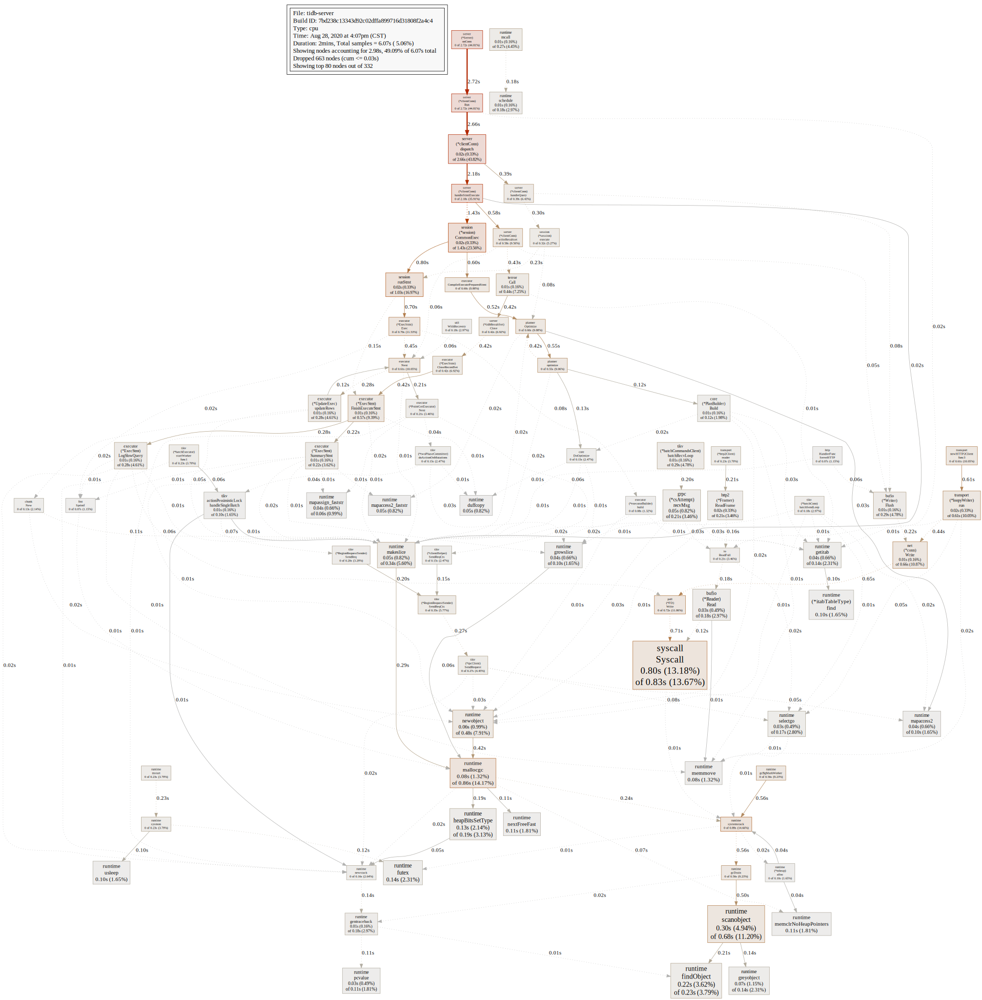
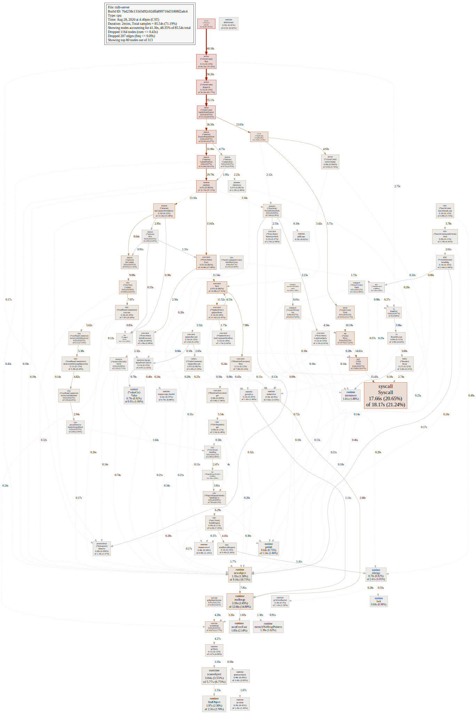
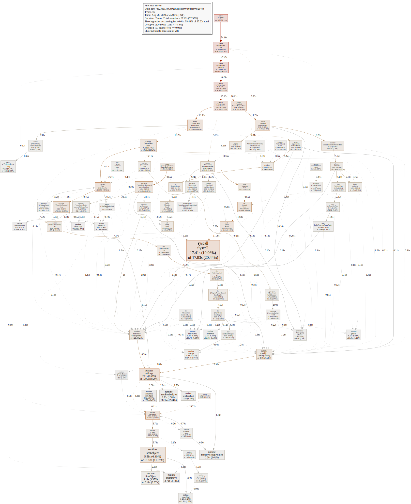
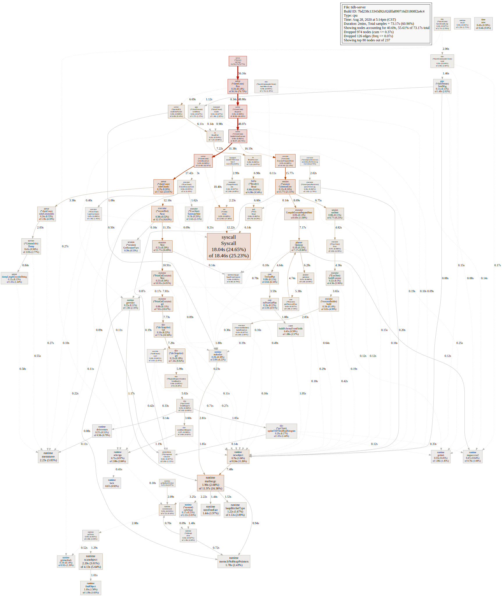
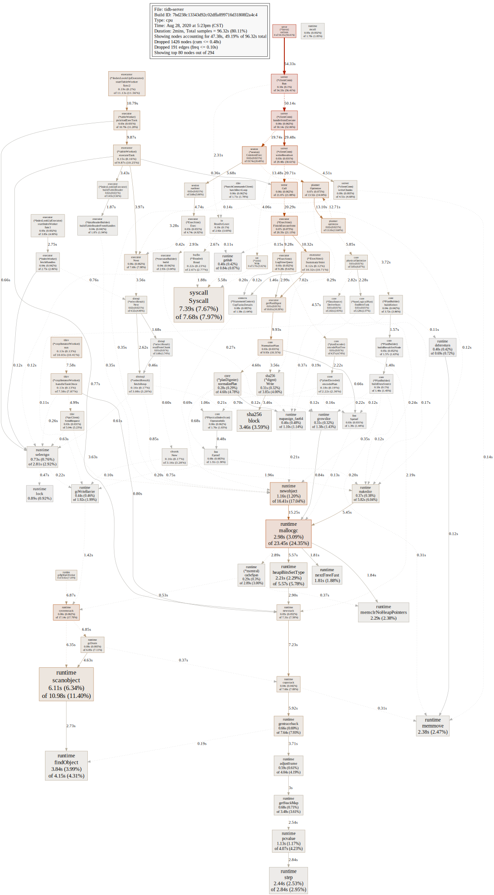
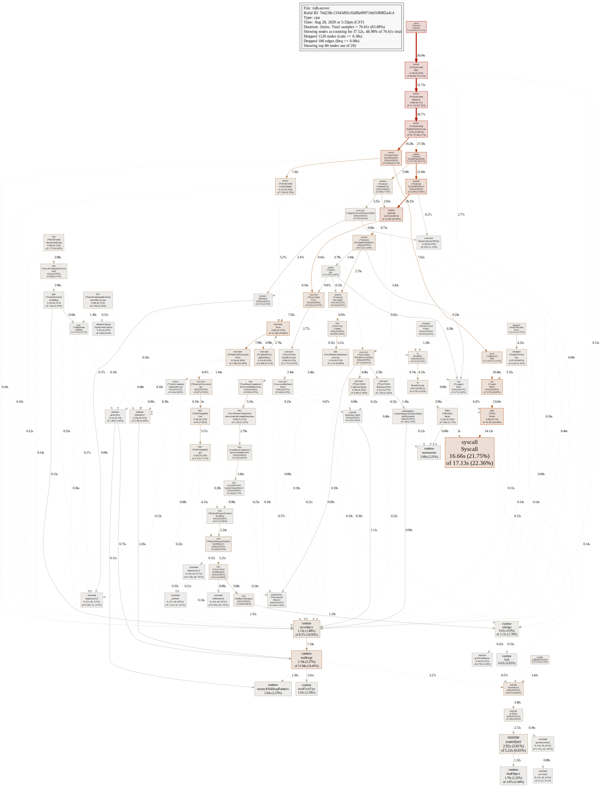

# 高性能TiDB课程作业（第三周）

分值：1 个有效 issue 100，有效 PR 根据实际效果进行相应加分，比如能节省 CPU、减少内存占用、减少 IO 次数等。

题目描述：

使用上一节可以讲的 sysbench、go-ycsb 或者 go-tpc 对 TiDB 进行压力测试， 然后对 TiDB 或 TiKV 的 CPU 、内存或 IO 进行 profile，寻找潜在可以优化的地 方并提 enhance 类型的 issue 描述。

issue 描述应包含：

- 部署环境的机器配置（CPU、内存、磁盘规格型号），拓扑结构（TiDB、TiKV 各部署于哪些节点）
- 跑的 workload 情况
- 对应的 profile 看到的情况
- 建议如何优化？

【可选】提 PR 进行优化：

- 按照 PR 模板提交优化 PR

**输出**：对 TiDB 或 TiKV 进行 profile，写文章描述 分析的过程，对于可以优化的地方提 issue 描述，并将 issue 贴到文章中（或【可选】提 PR 进行优化，将 PR 贴到文章中）

截止时间：9.1 24:00（逾期提交不给分）

## 1. 机器配置

- CPU 3.1 GHz 四核Intel Core i5
- 内存 16 GB 1867 MHz DDR3
- 磁盘规格型号 APPLE HDD HTS541010A9E662 1 TB 5400 RPM

## 2. 拓扑结构

| IP地址             | 角色                  | 操作系统        | 核数          | 内存|
| ---               | ---                   | ---           | ---           | ---|
| 192.168.99.101    | TiDB Server           | CentOS 8.3.1  | 1vCPU         | 4GB|
| 192.168.99.102    | TiKV Server           | CentOS 8.3.1  | 4vCPU         | 4GB|
| 192.168.99.103    | PD Server             | CentOS 8.3.1  | 2vCPU         | 1GB|
| 192.168.99.103    | Prometheus Server     | -             | -             | -  |
| 192.168.99.103    | Grafana Server        | -             | -             | -  |
| 192.168.99.103    | Alertmanager Server   | -             | -             | -  |

### 2.1 TiDB&TiKV服务器配置

```yaml
server_configs:
  tidb:
    binlog.enable: false
    binlog.ignore-error: false
    enable-streaming: true
    log.enable-slow-log: false
    log.slow-threshold: 300
    oom-use-tmp-storage: false
    performance.tcp-keep-alive: true
    prepared-plan-cache.enabled: true
  tikv:
    backup.num-threads: 1
    pessimistic-txn.pipelined: true
    raftdb.max-background-jobs: 4
    readpool.coprocessor.use-unified-pool: true
    readpool.storage.use-unified-pool: true
    readpool.unified.max-thread-count: 4
    rocksdb.max-background-jobs: 4
    server.grpc-concurrency: 4
  pd:
    schedule.leader-schedule-limit: 2
    schedule.region-schedule-limit: 1024
    schedule.replica-schedule-limit: 32
```

## 3. 使用Go-YCSB进行压测及分析

Go-YCSB共有a-f六种负载，每种负载都由至少一种SQL命令按比例组合而成，不进行投影，请求量/时间呈正态分布。以下测试均采用256个线程模拟并发。

```bash
./bin/go-ycsb run mysql -P workloads/workloadx
  -p operationcount=1000000
  -p mysql.host=192.168.99.101
  -p mysql.port=4000 --threads 256
```

## 3.1 数据模式及数据集大小

### 3.1.1 数据模式

usertable(<u style="color:red;">YCSB_KEY</u>, FIELD0, FIELD1, FIELD2, FIELD3, FIELD4, FIELD5, FIELD6, FIELD7, FIELD8, FIELD9)

```sql
CREATE TABLE usertable (
  YCSB_KEY VARCHAR(64) PRIMARY KEY,
  FIELD0 VARCHAR(100),
  FIELD1 VARCHAR(100),
  FIELD2 VARCHAR(100),
  FIELD3 VARCHAR(100),
  FIELD4 VARCHAR(100),
  FIELD5 VARCHAR(100),
  FIELD6 VARCHAR(100),
  FIELD7 VARCHAR(100),
  FIELD8 VARCHAR(100),
  FIELD9 VARCHAR(100),
  PRIMARY KEY (`YCSB_KEY`)
);
```

### 3.1.2 数据集大小

```sql
mysql> select count(1) from usertable;
```

```shell
+----------+
| count(1) | 
+----------+
|   999936 |
+----------+
```

## 3.2 Workload涉及的SQL

Go-YCSB负载有`Read`(点查询)、`Scan`(范围查询)、`Insert`、`Update`(点查询)、`Delete`(点查询)，以下会列出对应的SQL模板。

### 3.2.1 Read

```sql
SELECT $fields FROM $table $forceIndexKey WHERE YCSB_KEY = ?
```

### 3.2.2 Scan

```sql
SELECT $fields FROM $table $forceIndexKey WHERE YCSB_KEY >= ? LIMIT ?
```

### 3.2.3 Insert

```sql
INSERT IGNORE INTO $table ($field1, $field2, ...) VALUES (?, ?, ...)
```

### 3.2.4 Update

```sql
UPDATE $table set $field1 = ?, $field2 = ? ... WHERE YCSB_KEY = ?
```

### 3.2.5 Delete

```sql
DELETE FROM $table WHERE YCSB_KEY = ?
```

## 3.3 TiDB profile采集与分析

### 3.3.1 Workload a

#### 3.3.1.1 负载配置

```bash
"threadcount"="256"
"mysql.host"="192.168.99.101"
"updateproportion"="0.5"
"insertproportion"="0"
"mysql.port"="4000"
"workload"="core"
"requestdistribution"="uniform"
"dotransactions"="true"
"recordcount"="1000"
"operationcount"="1000000"
"scanproportion"="0"
"readproportion"="0.5"
"readallfields"="true"
```

#### 3.3.1.2 压测结果

```bash
READ   - Takes(s): 215.8, Count: 115432, OPS: 535.0, Avg(us): 115576, Min(us): 1795, Max(us): 5059776, 99th(us): 357000, 99.9th(us): 1072000, 99.99th(us): 2871000
UPDATE - Takes(s): 211.6, Count: 114645, OPS: 541.9, Avg(us): 347580, Min(us): 8232, Max(us): 13621982, 99th(us): 1335000, 99.9th(us): 4250000, 99.99th(us): 7361000
```

### 3.3.1.1 TiDB profile of workload a



### 3.3.1.2 分析

#### 3.3.1.2.1 CPU

Workload a是50%的`Read`操作和50%的`Update`操作组成的负载，从profile中可以得到以下信息：

1. 采样了120秒，采集样本只有6.07秒，TiDB的CPU使用率非常低
2. 样本的时间消耗主要聚集在
    1. session.session.CommonExec 23.56%
    2. runtime.mallocgc 14.17%
    3. runtime.scanobject 11.2%
    4. net.conn.Write 10.05%
    5. server.clientConn.writeResult 9.56%

#### 3.3.1.2.2 内存

TODO

#### 3.3.1.2.3 IO

TODO

### 3.3.1.3 结论

Workload a下主要CPU消耗使用在执行SQL计算、内存分配和GC上了，其余一小部分的开销主要在网络IO上。
SQL计算开销对应的是session.session.CommonExec执行的时间，内存分配和GC开销对应的是runtime.mallocgc与runtime.scanobject执行时间之和，网络IO的开销大约小于等于syscall.Syscall的执行时间。
session.session.CommonExec又可以细分成plan.Optimize(9.88%)、executor.ExecStmt.Exec(11.53%)
因此，假设优化相同比例的开销，内存分配与GC的耗时占比比较大，减少内存的消耗可以作为优先的优化规则。其次是网络IO、查询执行器、查询计划优化器。

### 3.3.2 Workload b

```bash
# Yahoo! Cloud System Benchmark
# Workload B: Read mostly workload
#   Application example: photo tagging; add a tag is an update, but most operations are to read tags
#                        
#   Read/update ratio: 95/5
#   Default data size: 1 KB records (10 fields, 100 bytes each, plus key)
#   Request distribution: zipfian

recordcount=1000
operationcount=1000
workload=core

readallfields=true

readproportion=0.95
updateproportion=0.05
scanproportion=0
insertproportion=0

requestdistribution=uniform
```

### 3.3.2.1 TiDB profile of workload b



### 3.3.2.2 分析

Workload b是95%的`Read`操作和5%的`Update`操作组成的负载，从profile中可以得到以下信息：

1. 采样了120秒，采集样本85.54秒，TiDB的CPU使用率高达71.19%
2. 相较于`Update`操作较繁重的workload a，减少`Update`操作的workload b显著的提高了CPU的利用率
3. 样本的时间消耗主要聚集在

### 3.3.2.3 结论

TODO

### 3.3.3 Workload c

```bash
# Yahoo! Cloud System Benchmark
# Workload C: Read only
#   Application example: user profile cache, where profiles are constructed elsewhere (e.g., Hadoop)
#                        
#   Read/update ratio: 100/0
#   Default data size: 1 KB records (10 fields, 100 bytes each, plus key)
#   Request distribution: zipfian

recordcount=1000
operationcount=1000
workload=core

readallfields=true

readproportion=1
updateproportion=0
scanproportion=0
insertproportion=0

requestdistribution=uniform
```

### 3.3.3.1 TiDB profile of workload c



### 3.3.3.2 分析

Workload c是100%的`Read`操作的负载，从profile中可以得到以下信息：

1. 采样了120秒，采集样本87.22秒，TiDB的CPU使用率高达72.57%
2. 相较于拥有少量`Update`操作的workload b，workload c的CPU使用率非常相近，少量的`Update`操作对`Read`操作的影响很小
3. 样本的时间消耗主要聚集在

### 3.3.3.3 结论

TODO

### 3.3.4 Workload d

```bash
# Yahoo! Cloud System Benchmark
# Workload D: Read latest workload
#   Application example: user status updates; people want to read the latest
#                        
#   Read/update/insert ratio: 95/0/5
#   Default data size: 1 KB records (10 fields, 100 bytes each, plus key)
#   Request distribution: latest

# The insert order for this is hashed, not ordered. The "latest" items may be 
# scattered around the keyspace if they are keyed by userid.timestamp. A workload
# which orders items purely by time, and demands the latest, is very different than 
# workload here (which we believe is more typical of how people build systems.)

recordcount=1000
operationcount=1000
workload=core

readallfields=true

readproportion=0.95
updateproportion=0
scanproportion=0
insertproportion=0.05

requestdistribution=latest
```

### 3.3.4.1 TiDB profile of workload d



### 3.3.4.2 分析

Workload d是95%的`Read`操作和5%的`Insert`操作组成的负载，从profile中可以得到以下信息：

1. 采样了120秒，采集样本73.17秒，TiDB的CPU使用率高达60.90%
2. 相较于拥有等量`Update`操作的workload b，workload d的CPU使用率小幅下降，少量的`Insert`操作对`Read`操作的影响较明显
3. 样本的时间消耗主要聚集在

### 3.3.4.3 结论

### 3.3.5 Workload e

```bash
# Yahoo! Cloud System Benchmark
# Workload E: Short ranges
#   Application example: threaded conversations, where each scan is for the posts in a given thread (assumed to be clustered by thread id)
#                        
#   Scan/insert ratio: 95/5
#   Default data size: 1 KB records (10 fields, 100 bytes each, plus key)
#   Request distribution: zipfian

# The insert order is hashed, not ordered. Although the scans are ordered, it does not necessarily
# follow that the data is inserted in order. For example, posts for thread 342 may not be inserted contiguously, but
# instead interspersed with posts from lots of other threads. The way the YCSB client works is that it will pick a start
# key, and then request a number of records; this works fine even for hashed insertion.

recordcount=1000
operationcount=1000
workload=core

readallfields=true

readproportion=0
updateproportion=0
scanproportion=0.95
insertproportion=0.05

requestdistribution=uniform

maxscanlength=1

scanlengthdistribution=uniform
```

### 3.3.5.1 TiDB profile of workload e



### 3.3.5.2 分析

Workload e是95%的`Scan`操作和5%的`Insert`操作组成的负载，从profile中可以得到以下信息：

1. 采样了120秒，采集样本87.22秒，TiDB的CPU使用率高达72.57%
2. 相较于拥有少量`Update`操作的workload b，workload c的CPU使用率非常相近，少量的`Update`操作对`Read`操作的影响很小
3. 样本的时间消耗主要聚集在

### 3.3.5.3 结论

TODO

### 3.3.6 Workload f

```bash
# Yahoo! Cloud System Benchmark
# Workload F: Read-modify-write workload
#   Application example: user database, where user records are read and modified by the user or to record user activity.
#                        
#   Read/read-modify-write ratio: 50/50
#   Default data size: 1 KB records (10 fields, 100 bytes each, plus key)
#   Request distribution: zipfian

recordcount=1000
operationcount=1000
workload=core

readallfields=true

readproportion=0.5
updateproportion=0
scanproportion=0
insertproportion=0
readmodifywriteproportion=0.5

requestdistribution=uniform
```

### 3.3.6.1 TiDB profile of workload f



### 3.3.6.2 分析

Workload f是50%的`Read`操作和50%的`Read`+`Update`(readmodifywrite)操作组成的负载，从profile中可以得到以下信息：

1. 采样了120秒，采集样本76.61秒，TiDB的CPU使用率高达63.68%
2. 尽管`Update`操作占比不小，CPU使用率远高于workload a
3. 样本的时间消耗主要聚集在

### 3.3.6.3 结论

TODO

## 4. 总结

TODO
