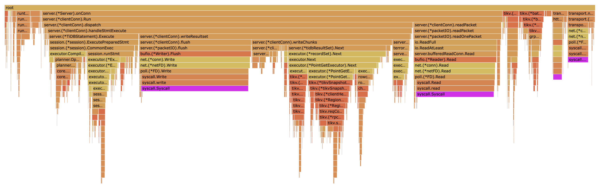

# 高性能TiDB课程作业（第三周）

分值：1 个有效 issue 100，有效 PR 根据实际效果进行相应加分，比如能节省 CPU、减少内存占用、减少 IO 次数等。

题目描述：

使用上一节可以讲的 sysbench、go-ycsb 或者 go-tpc 对 TiDB 进行压力测试， 然后对 TiDB 或 TiKV 的 CPU 、内存或 IO 进行 profile，寻找潜在可以优化的地 方并提 enhance 类型的 issue 描述。

issue 描述应包含：

- 部署环境的机器配置（CPU、内存、磁盘规格型号），拓扑结构（TiDB、TiKV 各部署于哪些节点）
- 跑的 workload 情况
- 对应的 profile 看到的情况
- 建议如何优化？

【可选】提 PR 进行优化：

- 按照 PR 模板提交优化 PR

**输出**：对 TiDB 或 TiKV 进行 profile，写文章描述 分析的过程，对于可以优化的地方提 issue 描述，并将 issue 贴到文章中（或【可选】提 PR 进行优化，将 PR 贴到文章中）

截止时间：9.1 24:00（逾期提交不给分）

## 1. 机器配置

- CPU 3.1 GHz 四核Intel Core i5
- 内存 16 GB 1867 MHz DDR3
- 磁盘规格型号 APPLE HDD HTS541010A9E662 1 TB 5400 RPM

## 2. 拓扑结构

| IP地址             | 角色                  | 操作系统        | 核数          | 内存|
| ---               | ---                   | ---           | ---           | ---|
| 192.168.99.101    | TiDB Server           | CentOS 8.3.1  | 1vCPU         | 4GB|
| 192.168.99.102    | TiKV Server           | CentOS 8.3.1  | 4vCPU         | 4GB|
| 192.168.99.103    | PD Server             | CentOS 8.3.1  | 2vCPU         | 1GB|
| 192.168.99.103    | Prometheus Server     | -             | -             | -  |
| 192.168.99.103    | Grafana Server        | -             | -             | -  |
| 192.168.99.103    | Alertmanager Server   | -             | -             | -  |

### 2.1 服务器配置

```yaml
server_configs:
  tidb:
    binlog.enable: false
    binlog.ignore-error: false
    enable-streaming: true
    log.enable-slow-log: false
    log.slow-threshold: 300
    oom-use-tmp-storage: false
    performance.tcp-keep-alive: true
    prepared-plan-cache.enabled: true
  tikv:
    backup.num-threads: 1
    pessimistic-txn.pipelined: true
    raftdb.max-background-jobs: 4
    readpool.coprocessor.use-unified-pool: true
    readpool.storage.use-unified-pool: true
    readpool.unified.max-thread-count: 4
    rocksdb.max-background-jobs: 4
    server.grpc-concurrency: 4
  pd:
    schedule.leader-schedule-limit: 2
    schedule.region-schedule-limit: 1024
    schedule.replica-schedule-limit: 32
```

## 3. 使用Go-YCSB进行压测及分析

Go-YCSB共有a-f六种负载，每种负载都由至少一种SQL命令按比例组合而成，不进行投影，请求量/时间呈正态分布。以下测试均采用256个线程模拟并发，本次报告的性能分析对象是TiDB。

```bash
./bin/go-ycsb run mysql -P workloads/workloadx
  -p operationcount=1000000
  -p mysql.host=192.168.99.101
  -p mysql.port=4000 --threads 256
```

### 3.1 数据模式及数据集大小

#### 3.1.1 数据模式

usertable(<u style="color:red;">YCSB_KEY</u>, FIELD0, FIELD1, FIELD2, FIELD3, FIELD4, FIELD5, FIELD6, FIELD7, FIELD8, FIELD9)

```sql
CREATE TABLE usertable (
  YCSB_KEY VARCHAR(64) PRIMARY KEY,
  FIELD0 VARCHAR(100),
  FIELD1 VARCHAR(100),
  FIELD2 VARCHAR(100),
  FIELD3 VARCHAR(100),
  FIELD4 VARCHAR(100),
  FIELD5 VARCHAR(100),
  FIELD6 VARCHAR(100),
  FIELD7 VARCHAR(100),
  FIELD8 VARCHAR(100),
  FIELD9 VARCHAR(100),
  PRIMARY KEY (`YCSB_KEY`)
);
```

#### 3.1.2 数据集大小

```sql
mysql> select count(1) from usertable;
```

```bash
+----------+
| count(1) | 
+----------+
|   999936 |
+----------+
```

### 3.2 Workload涉及的SQL

Go-YCSB负载有`Read`(点查询)、`Scan`(范围查询)、`Insert`、`Update`(点查询)、`Delete`(点查询)，以下会列出对应的SQL模板。

#### 3.2.1 Read

```sql
SELECT $fields FROM $table $forceIndexKey WHERE YCSB_KEY = ?
```

#### 3.2.2 Scan

```sql
SELECT $fields FROM $table $forceIndexKey WHERE YCSB_KEY >= ? LIMIT ?
```

#### 3.2.3 Insert

```sql
INSERT IGNORE INTO $table ($field1, $field2, ...) VALUES (?, ?, ...)
```

#### 3.2.4 Update

```sql
UPDATE $table set $field1 = ?, $field2 = ? ... WHERE YCSB_KEY = ?
```

#### 3.2.5 Delete

```sql
DELETE FROM $table WHERE YCSB_KEY = ?
```

### 3.3 TiDB profile采集与分析

#### 3.3.1 Workload a

##### 3.3.1.1 负载配置

```bash
"threadcount"="256"
"mysql.host"="192.168.99.101"
"updateproportion"="0.5"
"insertproportion"="0"
"mysql.port"="4000"
"workload"="core"
"requestdistribution"="uniform"
"dotransactions"="true"
"recordcount"="1000"
"operationcount"="1000000"
"scanproportion"="0"
"readproportion"="0.5"
"readallfields"="true"
```

##### 3.3.1.2 压测结果

```bash
READ   - Takes(s): 215.8, Count: 115432, OPS: 535.0, Avg(us): 115576, Min(us): 1795, Max(us): 5059776, 99th(us): 357000, 99.9th(us): 1072000, 99.99th(us): 2871000
UPDATE - Takes(s): 211.6, Count: 114645, OPS: 541.9, Avg(us): 347580, Min(us): 8232, Max(us): 13621982, 99th(us): 1335000, 99.9th(us): 4250000, 99.99th(us): 7361000
```

##### 3.3.1.3 CPU

```bash
# 根据执行加调用外部函数时长逆序排列得到前15项函数
go tool pprof -nodecount 15 -cum -tree  profile

Duration: 2mins, Total samples = 76.57s (63.73%)
Showing nodes accounting for 17.09s, 22.32% of 76.57s total
Dropped 1095 nodes (cum <= 0.38s)
Showing top 15 nodes out of 293
----------------------------------------------------------+-------------
      flat  flat%   sum%        cum   cum%   calls calls% + context 	 	 
----------------------------------------------------------+-------------
         0     0%     0%     51.76s 67.60%                | github.com/pingcap/tidb/server.(*Server).onConn
                                            51.76s   100% |   github.com/pingcap/tidb/server.(*clientConn).Run
----------------------------------------------------------+-------------
                                            51.76s   100% |   github.com/pingcap/tidb/server.(*Server).onConn
     0.16s  0.21%  0.21%     51.76s 67.60%                | github.com/pingcap/tidb/server.(*clientConn).Run
                                            48.70s 94.09% |   github.com/pingcap/tidb/server.(*clientConn).dispatch
                                             1.34s  2.59% |   syscall.Syscall
----------------------------------------------------------+-------------
                                            48.70s   100% |   github.com/pingcap/tidb/server.(*clientConn).Run
     0.10s  0.13%  0.34%     48.70s 63.60%                | github.com/pingcap/tidb/server.(*clientConn).dispatch
                                            47.72s 97.99% |   github.com/pingcap/tidb/server.(*clientConn).handleStmtExecute
----------------------------------------------------------+-------------
                                            47.72s   100% |   github.com/pingcap/tidb/server.(*clientConn).dispatch
     0.08s   0.1%  0.44%     47.72s 62.32%                | github.com/pingcap/tidb/server.(*clientConn).handleStmtExecute
                                            30.77s 64.48% |   github.com/pingcap/tidb/server.(*TiDBStatement).Execute
                                             9.33s 19.55% |   net.(*conn).Write
----------------------------------------------------------+-------------
                                            30.77s   100% |   github.com/pingcap/tidb/server.(*clientConn).handleStmtExecute
         0     0%  0.44%     30.77s 40.19%                | github.com/pingcap/tidb/server.(*TiDBStatement).Execute
                                            30.76s   100% |   github.com/pingcap/tidb/session.(*session).ExecutePreparedStmt
----------------------------------------------------------+-------------
                                            30.76s   100% |   github.com/pingcap/tidb/server.(*TiDBStatement).Execute
     0.07s 0.091%  0.54%     30.76s 40.17%                | github.com/pingcap/tidb/session.(*session).ExecutePreparedStmt
                                            26.58s 86.41% |   github.com/pingcap/tidb/session.(*session).CachedPlanExec
                                             1.87s  6.08% |   github.com/pingcap/tidb/session.runStmt
----------------------------------------------------------+-------------
                                            25.18s 93.05% |   github.com/pingcap/tidb/session.(*session).CachedPlanExec
                                             1.87s  6.91% |   github.com/pingcap/tidb/session.(*session).ExecutePreparedStmt
     0.06s 0.078%  0.61%     27.06s 35.34%                | github.com/pingcap/tidb/session.runStmt
                                            14.09s 52.07% |   github.com/pingcap/tidb/executor.(*ExecStmt).Exec
                                             0.47s  1.74% |   internal/poll.(*FD).Write
----------------------------------------------------------+-------------
                                            26.58s   100% |   github.com/pingcap/tidb/session.(*session).ExecutePreparedStmt
     0.03s 0.039%  0.65%     26.58s 34.71%                | github.com/pingcap/tidb/session.(*session).CachedPlanExec
                                            25.18s 94.73% |   github.com/pingcap/tidb/session.runStmt
----------------------------------------------------------+-------------
                                            14.48s 85.33% |   syscall.write
                                             1.34s  7.90% |   github.com/pingcap/tidb/server.(*clientConn).Run
    16.35s 21.35% 22.01%     16.97s 22.16%                | syscall.Syscall
----------------------------------------------------------+-------------
                                            14.11s 95.60% |   net.(*netFD).Write
                                             0.47s  3.18% |   github.com/pingcap/tidb/session.runStmt
     0.02s 0.026% 22.03%     14.76s 19.28%                | internal/poll.(*FD).Write
                                            14.50s 98.24% |   syscall.Write
----------------------------------------------------------+-------------
                                            14.50s   100% |   internal/poll.(*FD).Write
         0     0% 22.03%     14.50s 18.94%                | syscall.Write
                                            14.50s   100% |   syscall.write
----------------------------------------------------------+-------------
                                            14.50s   100% |   syscall.Write
     0.02s 0.026% 22.06%     14.50s 18.94%                | syscall.write
                                            14.48s 99.86% |   syscall.Syscall
----------------------------------------------------------+-------------
                                             9.33s 65.75% |   github.com/pingcap/tidb/server.(*clientConn).handleStmtExecute
     0.03s 0.039% 22.10%     14.19s 18.53%                | net.(*conn).Write
                                            14.16s 99.79% |   net.(*netFD).Write
----------------------------------------------------------+-------------
                                            14.16s   100% |   net.(*conn).Write
     0.05s 0.065% 22.16%     14.16s 18.49%                | net.(*netFD).Write
                                            14.11s 99.65% |   internal/poll.(*FD).Write
----------------------------------------------------------+-------------
                                            14.09s   100% |   github.com/pingcap/tidb/session.runStmt
     0.12s  0.16% 22.32%     14.09s 18.40%                | github.com/pingcap/tidb/executor.(*ExecStmt).Exec
----------------------------------------------------------+-------------
```

```bash
# 根据执行时长逆序排列得到15项函数
go tool pprof -nodecount 15 -flat -tree  profile

Duration: 2mins, Total samples = 76.57s (63.73%)
Showing nodes accounting for 33.51s, 43.76% of 76.57s total
Dropped 1095 nodes (cum <= 0.38s)
Showing top 15 nodes out of 293
----------------------------------------------------------+-------------
      flat  flat%   sum%        cum   cum%   calls calls% + context 	 	 
----------------------------------------------------------+-------------
    16.35s 21.35% 21.35%     16.97s 22.16%                | syscall.Syscall
----------------------------------------------------------+-------------
                                             1.54s 29.73% |   runtime.mallocgc
     2.49s  3.25% 24.60%      5.18s  6.77%                | runtime.scanobject
                                             1.60s 30.89% |   runtime.findObject
----------------------------------------------------------+-------------
                                             1.60s 66.67% |   runtime.scanobject
                                             0.17s  7.08% |   runtime.selectgo
     2.16s  2.82% 27.43%      2.40s  3.13%                | runtime.findObject
----------------------------------------------------------+-------------
                                             6.54s 62.95% |   runtime.newobject
     2.08s  2.72% 30.14%     10.39s 13.57%                | runtime.mallocgc
                                             2.01s 19.35% |   runtime.heapBitsSetType
                                             1.54s 14.82% |   runtime.scanobject
                                             1.52s 14.63% |   runtime.nextFreeFast
                                             1.21s 11.65% |   runtime.memclrNoHeapPointers
----------------------------------------------------------+-------------
                                             1.52s   100% |   runtime.mallocgc
     1.52s  1.99% 32.13%      1.52s  1.99%                | runtime.nextFreeFast
----------------------------------------------------------+-------------
                                             2.01s   100% |   runtime.mallocgc
     1.42s  1.85% 33.98%      2.01s  2.63%                | runtime.heapBitsSetType
----------------------------------------------------------+-------------
                                             1.21s 96.03% |   runtime.mallocgc
     1.26s  1.65% 35.63%      1.26s  1.65%                | runtime.memclrNoHeapPointers
----------------------------------------------------------+-------------
     1.22s  1.59% 37.22%      7.76s 10.13%                | runtime.newobject
                                             6.54s 84.28% |   runtime.mallocgc
----------------------------------------------------------+-------------
     1.12s  1.46% 38.68%      1.12s  1.46%                | runtime.memmove
----------------------------------------------------------+-------------
                                             0.80s   100% |   runtime.getitab
     0.79s  1.03% 39.72%      0.80s  1.04%                | runtime.(*itabTableType).find
----------------------------------------------------------+-------------
     0.73s  0.95% 40.67%      2.36s  3.08%                | runtime.selectgo
                                             0.29s 12.29% |   runtime.lock
                                             0.17s  7.20% |   runtime.findObject
----------------------------------------------------------+-------------
     0.70s  0.91% 41.58%      0.75s  0.98%                | context.(*valueCtx).Value
----------------------------------------------------------+-------------
                                             0.29s 49.15% |   runtime.selectgo
     0.59s  0.77% 42.35%      0.59s  0.77%                | runtime.lock
----------------------------------------------------------+-------------
     0.54s  0.71% 43.06%      1.34s  1.75%                | runtime.getitab
                                             0.80s 59.70% |   runtime.(*itabTableType).find
----------------------------------------------------------+-------------
     0.54s  0.71% 43.76%      0.63s  0.82%                | runtime.step
----------------------------------------------------------+-------------
```


从profile中可以得到以下信息：

1. 采样了120秒，采集样本76.57秒，TiDB的CPU使用率高达63.73%
2. 样本的时间消耗主要聚集在server.(*clientConn).handleStmtExecute及其调用的子函数
3. syscall.Syscall代表IO的开销，它消耗了程序22.16%的时间，并且主要集中在
    - server.(\*clientConn).writeOK
    - server.(\*clientConn).writeResultSet
    - net.(*conn).Write
4. runtime.mallocgc和runtime.newobject代表内存管理的开销，它消耗了程序20.34%的时间

##### 3.3.1.4 内存

```bash
# 根据执行申请内存逆序排列得到15项函数
go tool pprof -nodecount 15 -flat -tree heap

Showing nodes accounting for 49.94MB, 59.85% of 83.43MB total
Showing top 15 nodes out of 269
----------------------------------------------------------+-------------
      flat  flat%   sum%        cum   cum%   calls calls% + context 	 	 
----------------------------------------------------------+-------------
      10MB 11.99% 11.99%    16.50MB 19.78%                | github.com/pingcap/tidb/planner/core.buildSchemaFromFields
                                               6MB 36.36% |   github.com/pingcap/tidb/planner/core.colInfoToColumn
----------------------------------------------------------+-------------
    7.74MB  9.27% 21.26%     7.74MB  9.27%                | github.com/pingcap/tidb/util/arena.NewAllocator
----------------------------------------------------------+-------------
                                               6MB   100% |   github.com/pingcap/tidb/planner/core.buildSchemaFromFields
       6MB  7.19% 28.45%        6MB  7.19%                | github.com/pingcap/tidb/planner/core.colInfoToColumn
----------------------------------------------------------+-------------
    4.06MB  4.87% 33.32%     4.06MB  4.87%                | bufio.NewReaderSize
----------------------------------------------------------+-------------
                                            4.50MB   100% |   github.com/pingcap/tidb/server.(*TiDBContext).Prepare
    3.50MB  4.20% 37.52%     4.50MB  5.39%                | github.com/pingcap/parser.yyParse
----------------------------------------------------------+-------------
    2.54MB  3.04% 40.56%     2.54MB  3.04%                | bufio.NewWriterSize
----------------------------------------------------------+-------------
    2.54MB  3.04% 43.61%     2.54MB  3.04%                | github.com/pingcap/parser.New
----------------------------------------------------------+-------------
    2.50MB  3.00% 46.60%    11.50MB 13.79%                | github.com/pingcap/tidb/planner/core.buildPointUpdatePlan
                                               6MB 52.17% |   github.com/pingcap/tidb/expression.BuildCastFunction
                                            1.50MB 13.04% |   github.com/pingcap/tidb/expression.ParamMarkerExpression
----------------------------------------------------------+-------------
                                               2MB   100% |   github.com/pingcap/tidb/expression.BuildCastFunction
       2MB  2.40% 49.00%        2MB  2.40%                | github.com/pingcap/tidb/expression.foldConstant
----------------------------------------------------------+-------------
    1.55MB  1.86% 50.86%     1.55MB  1.86%                | bytes.makeSlice
----------------------------------------------------------+-------------
    1.50MB  1.80% 52.66%        2MB  2.40%                | github.com/pingcap/tidb/executor.ResetContextOfStmt
----------------------------------------------------------+-------------
                                            2.50MB   100% |   github.com/pingcap/tidb/expression.BuildCastFunction
    1.50MB  1.80% 54.46%     2.50MB  3.00%                | github.com/pingcap/tidb/expression.(*castAsStringFunctionClass).getFunction
----------------------------------------------------------+-------------
                                            1.50MB   100% |   github.com/pingcap/tidb/planner/core.buildPointUpdatePlan
    1.50MB  1.80% 56.26%     1.50MB  1.80%                | github.com/pingcap/tidb/expression.ParamMarkerExpression
----------------------------------------------------------+-------------
    1.50MB  1.80% 58.06%        8MB  9.59%                | github.com/pingcap/tidb/server.(*TiDBContext).Prepare
                                            4.50MB 56.25% |   github.com/pingcap/parser.yyParse
----------------------------------------------------------+-------------
                                               6MB   100% |   github.com/pingcap/tidb/planner/core.buildPointUpdatePlan
    1.50MB  1.80% 59.85%        6MB  7.19%                | github.com/pingcap/tidb/expression.BuildCastFunction
                                            2.50MB 41.67% |   github.com/pingcap/tidb/expression.(*castAsStringFunctionClass).getFunction
                                               2MB 33.34% |   github.com/pingcap/tidb/expression.foldConstant
----------------------------------------------------------+-------------
```


从profile中可以得到以下信息：

1. 内存消耗主要集中在executor.CompileExecutePrepareStmt 41.96%
2. 申请内存比较多又属于executor.CompileExecutePrepareStmt调用的子函数有
    - core.buildSchemaFromFields
    - core.buildPointUpdatePlan

##### 3.3.1.5 IO


根据以上监控数据可以得出：

1. TiKV结点的负载很高
2. IO利用率高
3. 磁盘带宽非常低，应该大约等同于网络带宽
4. 写入操作的IOPS非常高

##### 3.3.1.6 结论

Workload a是50%的`Read`操作和50%的`Update`操作组成的负载。在当前拓扑下，等待磁盘IO的开销占了不小比重，可能主要是由于设备磁盘性能的不足。网络IO开销占比不大。在SQL计算程序上，对内存的管理或许还有优化空间。

---

#### 3.3.2 Workload c

##### 3.3.2.1 负载配置

```bash
"updateproportion"="0"
"workload"="core"
"recordcount"="1000"
"readallfields"="true"
"threadcount"="256"
"requestdistribution"="uniform"
"insertproportion"="0"
"scanproportion"="0"
"mysql.port"="4000"
"dotransactions"="true"
"operationcount"="1000000"
"mysql.host"="192.168.99.101"
"readproportion"="1"
```

##### 3.3.2.2 压测结果

```bash
READ   - Takes(s): 399.5, Count: 999936, OPS: 2502.9, Avg(us): 97998, Min(us): 1923, Max(us): 20546032, 99th(us): 163000, 99.9th(us): 5863000, 99.99th(us): 20444000
```

##### 3.3.2.3 CPU

```bash
# 根据执行加调用外部函数时长逆序排列得到前15项函数
go tool pprof -tree -cum -nodecount 15 profile

Duration: 2mins, Total samples = 81.13s (67.53%)
Showing nodes accounting for 30.08s, 37.08% of 81.13s total
Dropped 803 nodes (cum <= 0.41s)
Showing top 15 nodes out of 218
----------------------------------------------------------+-------------
      flat  flat%   sum%        cum   cum%   calls calls% + context 	 	 
----------------------------------------------------------+-------------
         0     0%     0%     63.28s 78.00%                | github.com/pingcap/tidb/server.(*Server).onConn
                                            63.28s   100% |   github.com/pingcap/tidb/server.(*clientConn).Run
----------------------------------------------------------+-------------
                                            63.28s   100% |   github.com/pingcap/tidb/server.(*Server).onConn
     0.12s  0.15%  0.15%     63.28s 78.00%                | github.com/pingcap/tidb/server.(*clientConn).Run
                                            50.77s 80.23% |   github.com/pingcap/tidb/server.(*clientConn).dispatch
                                            10.69s 16.89% |   syscall.Syscall
----------------------------------------------------------+-------------
                                            50.77s   100% |   github.com/pingcap/tidb/server.(*clientConn).Run
     0.09s  0.11%  0.26%     50.77s 62.58%                | github.com/pingcap/tidb/server.(*clientConn).dispatch
                                            50.13s 98.74% |   github.com/pingcap/tidb/server.(*clientConn).handleStmtExecute
----------------------------------------------------------+-------------
                                            50.13s   100% |   github.com/pingcap/tidb/server.(*clientConn).dispatch
     0.08s 0.099%  0.36%     50.13s 61.79%                | github.com/pingcap/tidb/server.(*clientConn).handleStmtExecute
                                            37.26s 74.33% |   github.com/pingcap/tidb/server.(*clientConn).writeResultset
----------------------------------------------------------+-------------
                                            37.26s   100% |   github.com/pingcap/tidb/server.(*clientConn).handleStmtExecute
     0.06s 0.074%  0.43%     37.26s 45.93%                | github.com/pingcap/tidb/server.(*clientConn).writeResultset
                                            19.36s 51.96% |   github.com/pingcap/tidb/server.(*clientConn).writeChunks
                                            15.41s 41.36% |   github.com/pingcap/tidb/server.(*clientConn).flush
----------------------------------------------------------+-------------
                                            17.56s 59.49% |   syscall.write
                                            10.69s 36.21% |   github.com/pingcap/tidb/server.(*clientConn).Run
    29.06s 35.82% 36.25%     29.52s 36.39%                | syscall.Syscall
----------------------------------------------------------+-------------
                                            19.36s   100% |   github.com/pingcap/tidb/server.(*clientConn).writeResultset
     0.25s  0.31% 36.56%     19.36s 23.86%                | github.com/pingcap/tidb/server.(*clientConn).writeChunks
----------------------------------------------------------+-------------
                                            15.23s 84.14% |   bufio.(*Writer).Flush
     0.01s 0.012% 36.57%     18.10s 22.31%                | net.(*conn).Write
                                            18.09s 99.94% |   net.(*netFD).Write
----------------------------------------------------------+-------------
                                            18.09s   100% |   net.(*conn).Write
     0.19s  0.23% 36.81%     18.09s 22.30%                | net.(*netFD).Write
                                            17.90s 98.95% |   internal/poll.(*FD).Write
----------------------------------------------------------+-------------
                                            17.90s   100% |   net.(*netFD).Write
         0     0% 36.81%     17.90s 22.06%                | internal/poll.(*FD).Write
                                            17.60s 98.32% |   syscall.Write
----------------------------------------------------------+-------------
                                            17.60s   100% |   internal/poll.(*FD).Write
     0.02s 0.025% 36.83%     17.60s 21.69%                | syscall.Write
                                            17.58s 99.89% |   syscall.write
----------------------------------------------------------+-------------
                                            17.58s   100% |   syscall.Write
     0.02s 0.025% 36.85%     17.58s 21.67%                | syscall.write
                                            17.56s 99.89% |   syscall.Syscall
----------------------------------------------------------+-------------
                                            15.38s 99.61% |   github.com/pingcap/tidb/server.(*packetIO).flush
     0.15s  0.18% 37.04%     15.44s 19.03%                | bufio.(*Writer).Flush
                                            15.23s 98.64% |   net.(*conn).Write
----------------------------------------------------------+-------------
                                            15.41s   100% |   github.com/pingcap/tidb/server.(*clientConn).writeResultset
     0.03s 0.037% 37.08%     15.41s 18.99%                | github.com/pingcap/tidb/server.(*clientConn).flush
                                            15.38s 99.81% |   github.com/pingcap/tidb/server.(*packetIO).flush
----------------------------------------------------------+-------------
                                            15.38s   100% |   github.com/pingcap/tidb/server.(*clientConn).flush
         0     0% 37.08%     15.38s 18.96%                | github.com/pingcap/tidb/server.(*packetIO).flush
                                            15.38s   100% |   bufio.(*Writer).Flush
----------------------------------------------------------+-------------
```

```bash
# 根据执行时长逆序排列得到15项函数
go tool pprof -tree -flat -nodecount 15 profile

Duration: 2mins, Total samples = 81.13s (67.53%)
Showing nodes accounting for 43.38s, 53.47% of 81.13s total
Dropped 803 nodes (cum <= 0.41s)
Showing top 15 nodes out of 218
----------------------------------------------------------+-------------
      flat  flat%   sum%        cum   cum%   calls calls% + context 	 	 
----------------------------------------------------------+-------------
    29.06s 35.82% 35.82%     29.52s 36.39%                | syscall.Syscall
----------------------------------------------------------+-------------
     2.29s  2.82% 38.64%      2.29s  2.82%                | runtime.memmove
----------------------------------------------------------+-------------
                                             2.07s 63.30% |   runtime.mallocgc
     1.81s  2.23% 40.87%      3.27s  4.03%                | runtime.scanobject
                                             0.70s 21.41% |   runtime.findObject
----------------------------------------------------------+-------------
                                             5.76s 64.29% |   runtime.newobject
     1.70s  2.10% 42.97%      8.96s 11.04%                | runtime.mallocgc
                                             2.07s 23.10% |   runtime.scanobject
                                             1.35s 15.07% |   runtime.heapBitsSetType
                                             1.04s 11.61% |   runtime.memclrNoHeapPointers
                                             0.94s 10.49% |   runtime.nextFreeFast
----------------------------------------------------------+-------------
                                             1.04s 93.69% |   runtime.mallocgc
     1.11s  1.37% 44.34%      1.11s  1.37%                | runtime.memclrNoHeapPointers
----------------------------------------------------------+-------------
                                             1.35s   100% |   runtime.mallocgc
     1.05s  1.29% 45.63%      1.35s  1.66%                | runtime.heapBitsSetType
----------------------------------------------------------+-------------
                                             0.94s   100% |   runtime.mallocgc
     0.94s  1.16% 46.79%      0.94s  1.16%                | runtime.nextFreeFast
----------------------------------------------------------+-------------
     0.86s  1.06% 47.85%      6.62s  8.16%                | runtime.newobject
                                             5.76s 87.01% |   runtime.mallocgc
----------------------------------------------------------+-------------
                                             0.70s 77.78% |   runtime.scanobject
     0.80s  0.99% 48.84%      0.90s  1.11%                | runtime.findObject
----------------------------------------------------------+-------------
     0.79s  0.97% 49.81%      0.85s  1.05%                | time.now
----------------------------------------------------------+-------------
     0.76s  0.94% 50.75%      2.26s  2.79%                | runtime.selectgo
                                             0.38s 16.81% |   runtime.lock
----------------------------------------------------------+-------------
                                             0.38s 55.88% |   runtime.selectgo
     0.68s  0.84% 51.58%      0.68s  0.84%                | runtime.lock
----------------------------------------------------------+-------------
     0.56s  0.69% 52.27%      0.58s  0.71%                | runtime.(*itabTableType).find
----------------------------------------------------------+-------------
     0.49s   0.6% 52.88%      0.51s  0.63%                | context.(*valueCtx).Value
----------------------------------------------------------+-------------
     0.48s  0.59% 53.47%      0.86s  1.06%                | runtime.mapaccess2
----------------------------------------------------------+-------------

```



从profile中可以得到以下信息：

##### 3.3.2.4内存

```bash
# 根据执行申请内存逆序排列得到15项函数
go tool pprof -nodecount 15 -flat -tree heap

Showing nodes accounting for 28012.69kB, 75.19% of 37253.83kB total
Showing top 15 nodes out of 230
----------------------------------------------------------+-------------
      flat  flat%   sum%        cum   cum%   calls calls% + context 	 	 
----------------------------------------------------------+-------------
 6866.17kB 18.43% 18.43%  6866.17kB 18.43%                | github.com/pingcap/tidb/util/arena.NewAllocator
----------------------------------------------------------+-------------
 5200.42kB 13.96% 32.39%  5200.42kB 13.96%                | bufio.NewReaderSize
----------------------------------------------------------+-------------
 3632.45kB  9.75% 42.14%  3632.45kB  9.75%                | github.com/pingcap/parser.New
----------------------------------------------------------+-------------
 2600.21kB  6.98% 49.12%  2600.21kB  6.98%                | bufio.NewWriterSize
----------------------------------------------------------+-------------
 1536.16kB  4.12% 53.24%  1536.16kB  4.12%                | github.com/pingcap/parser.yyParse
----------------------------------------------------------+-------------
 1024.31kB  2.75% 55.99%  1024.31kB  2.75%                | github.com/pingcap/tidb/planner/core.getIndexValues
----------------------------------------------------------+-------------
 1024.22kB  2.75% 58.74%  1024.22kB  2.75%                | fmt.Sprintf
----------------------------------------------------------+-------------
 1024.15kB  2.75% 61.49%  2048.26kB  5.50%                | github.com/pingcap/tidb/statistics.PseudoTable
                                         1024.11kB 50.00% |   github.com/pingcap/tidb/util/chunk.newFixedLenColumn
----------------------------------------------------------+-------------
                                         1024.11kB   100% |   github.com/pingcap/tidb/statistics.PseudoTable
 1024.11kB  2.75% 64.24%  1024.11kB  2.75%                | github.com/pingcap/tidb/util/chunk.newFixedLenColumn
----------------------------------------------------------+-------------
 1024.05kB  2.75% 66.99%  1024.05kB  2.75%                | container/list.(*List).insertValue
----------------------------------------------------------+-------------
  902.59kB  2.42% 69.41%  1447.25kB  3.88%                | compress/flate.NewWriter
                                          544.67kB 37.63% |   compress/flate.(*compressor).initDeflate
----------------------------------------------------------+-------------
                                          544.67kB   100% |   compress/flate.NewWriter
  544.67kB  1.46% 70.87%   544.67kB  1.46%                | compress/flate.(*compressor).initDeflate
----------------------------------------------------------+-------------
  544.67kB  1.46% 72.34%   544.67kB  1.46%                | google.golang.org/grpc/internal/transport.newBufWriter
----------------------------------------------------------+-------------
  536.37kB  1.44% 73.78%   536.37kB  1.44%                | bytes.makeSlice
----------------------------------------------------------+-------------
  528.17kB  1.42% 75.19%   528.17kB  1.42%                | github.com/pingcap/tidb/types.BinaryLiteral.ToString
----------------------------------------------------------+-------------
```


从profile中可以得到以下信息：

##### 3.3.2.5 IO


根据以上监控数据可以得出：

##### 3.3.2.6 结论

Workload c是100%的`Read`操作的负载，QPS相较于workload a大幅提升。

---

#### 3.3.3 Workload e

##### 3.3.3.1 负载配置

```bash
"updateproportion"="0"
"workload"="core"
"requestdistribution"="uniform"
"maxscanlength"="1"
"scanproportion"="0.95"
"operationcount"="1000000"
"threadcount"="256"
"readallfields"="true"
"scanlengthdistribution"="uniform"
"dotransactions"="true"
"readproportion"="0"
"recordcount"="1000"
"mysql.host"="192.168.99.101"
"mysql.port"="4000"
"insertproportion"="0.05"
```

##### 3.3.3.2 压测结果

```bash
INSERT - Takes(s): 1201.7, Count: 49917, OPS: 41.5, Avg(us): 214754, Min(us): 2764, Max(us): 20166731, 99th(us): 389000, 99.9th(us): 8160000, 99.99th(us): 20053000
SCAN   - Takes(s): 1201.7, Count: 950019, OPS: 790.6, Avg(us): 307257, Min(us): 4079, Max(us): 21248821, 99th(us): 523000, 99.9th(us): 10371000, 99.99th(us): 20184000
```
##### 3.3.3.3 CPU

```bash
# 根据执行加调用外部函数时长逆序排列得到前15项函数
go tool pprof -nodecount 15 -cum -tree  profile

Duration: 2.01mins, Total samples = 96.74s (80.39%)
Showing nodes accounting for 5.49s, 5.68% of 96.74s total
Dropped 1485 nodes (cum <= 0.48s)
Showing top 15 nodes out of 316
----------------------------------------------------------+-------------
      flat  flat%   sum%        cum   cum%   calls calls% + context 	 	 
----------------------------------------------------------+-------------
         0     0%     0%     51.92s 53.67%                | github.com/pingcap/tidb/server.(*Server).onConn
                                            51.92s   100% |   github.com/pingcap/tidb/server.(*clientConn).Run
----------------------------------------------------------+-------------
                                            51.92s   100% |   github.com/pingcap/tidb/server.(*Server).onConn
     0.15s  0.16%  0.16%     51.92s 53.67%                | github.com/pingcap/tidb/server.(*clientConn).Run
                                            48.09s 92.62% |   github.com/pingcap/tidb/server.(*clientConn).dispatch
                                             0.25s  0.48% |   runtime.mallocgc
----------------------------------------------------------+-------------
                                            48.09s   100% |   github.com/pingcap/tidb/server.(*clientConn).Run
     0.07s 0.072%  0.23%     48.09s 49.71%                | github.com/pingcap/tidb/server.(*clientConn).dispatch
                                            47.01s 97.75% |   github.com/pingcap/tidb/server.(*clientConn).handleStmtExecute
                                             0.10s  0.21% |   runtime.newobject
----------------------------------------------------------+-------------
                                            47.01s   100% |   github.com/pingcap/tidb/server.(*clientConn).dispatch
     0.12s  0.12%  0.35%     47.01s 48.59%                | github.com/pingcap/tidb/server.(*clientConn).handleStmtExecute
                                            23.79s 50.61% |   github.com/pingcap/tidb/server.(*clientConn).writeResultset
                                            22.54s 47.95% |   github.com/pingcap/tidb/server.(*TiDBStatement).Execute
----------------------------------------------------------+-------------
                                            23.79s   100% |   github.com/pingcap/tidb/server.(*clientConn).handleStmtExecute
     0.01s  0.01%  0.36%     23.79s 24.59%                | github.com/pingcap/tidb/server.(*clientConn).writeResultset
                                             2.55s 10.72% |   runtime.newobject
                                             1.84s  7.73% |   runtime.mallocgc
                                             0.87s  3.66% |   runtime.systemstack
----------------------------------------------------------+-------------
                                            15.77s 67.71% |   runtime.newobject
                                             1.84s  7.90% |   github.com/pingcap/tidb/server.(*clientConn).writeResultset
                                             1.45s  6.23% |   github.com/pingcap/tidb/planner.optimize
                                             0.60s  2.58% |   github.com/pingcap/tidb/session.(*session).CommonExec
                                             0.25s  1.07% |   github.com/pingcap/tidb/server.(*clientConn).Run
                                             0.19s  0.82% |   github.com/pingcap/tidb/planner.Optimize
     3.12s  3.23%  3.59%     23.29s 24.07%                | runtime.mallocgc
                                             7.33s 31.47% |   runtime.systemstack
----------------------------------------------------------+-------------
                                            22.54s   100% |   github.com/pingcap/tidb/server.(*clientConn).handleStmtExecute
         0     0%  3.59%     22.54s 23.30%                | github.com/pingcap/tidb/server.(*TiDBStatement).Execute
                                            22.49s 99.78% |   github.com/pingcap/tidb/session.(*session).ExecutePreparedStmt
----------------------------------------------------------+-------------
                                            22.49s   100% |   github.com/pingcap/tidb/server.(*TiDBStatement).Execute
     0.01s  0.01%  3.60%     22.49s 23.25%                | github.com/pingcap/tidb/session.(*session).ExecutePreparedStmt
                                            22.16s 98.53% |   github.com/pingcap/tidb/session.(*session).CommonExec
----------------------------------------------------------+-------------
                                            22.16s   100% |   github.com/pingcap/tidb/session.(*session).ExecutePreparedStmt
     0.03s 0.031%  3.63%     22.16s 22.91%                | github.com/pingcap/tidb/session.(*session).CommonExec
                                            15.96s 72.02% |   github.com/pingcap/tidb/executor.CompileExecutePreparedStmt
                                             1.76s  7.94% |   runtime.newobject
                                             0.60s  2.71% |   runtime.mallocgc
                                             0.10s  0.45% |   runtime.systemstack
----------------------------------------------------------+-------------
                                             2.55s 14.51% |   github.com/pingcap/tidb/server.(*clientConn).writeResultset
                                             2.51s 14.29% |   github.com/pingcap/tidb/planner.optimize
                                             1.76s 10.02% |   github.com/pingcap/tidb/session.(*session).CommonExec
                                             0.33s  1.88% |   github.com/pingcap/tidb/planner.Optimize
                                             0.26s  1.48% |   github.com/pingcap/tidb/executor.CompileExecutePreparedStmt
                                             0.10s  0.57% |   github.com/pingcap/tidb/server.(*clientConn).dispatch
     1.80s  1.86%  5.49%     17.57s 18.16%                | runtime.newobject
                                            15.77s 89.76% |   runtime.mallocgc
----------------------------------------------------------+-------------
                                             7.33s 42.32% |   runtime.mallocgc
                                             0.87s  5.02% |   github.com/pingcap/tidb/server.(*clientConn).writeResultset
                                             0.40s  2.31% |   github.com/pingcap/tidb/planner.optimize
                                             0.10s  0.58% |   github.com/pingcap/tidb/session.(*session).CommonExec
     0.10s   0.1%  5.59%     17.32s 17.90%                | runtime.systemstack
----------------------------------------------------------+-------------
                                            15.96s   100% |   github.com/pingcap/tidb/session.(*session).CommonExec
         0     0%  5.59%     15.96s 16.50%                | github.com/pingcap/tidb/executor.CompileExecutePreparedStmt
                                            15.41s 96.55% |   github.com/pingcap/tidb/planner.Optimize
                                             0.26s  1.63% |   runtime.newobject
----------------------------------------------------------+-------------
                                            15.41s 99.55% |   github.com/pingcap/tidb/executor.CompileExecutePreparedStmt
                                            14.54s 93.93% |   github.com/pingcap/tidb/planner/core.(*Execute).OptimizePreparedPlan
     0.01s  0.01%  5.60%     15.48s 16.00%                | github.com/pingcap/tidb/planner.Optimize
                                            15.14s 97.80% |   github.com/pingcap/tidb/planner.optimize
                                             0.33s  2.13% |   runtime.newobject
                                             0.19s  1.23% |   runtime.mallocgc
----------------------------------------------------------+-------------
                                            15.14s   100% |   github.com/pingcap/tidb/planner.Optimize
     0.01s  0.01%  5.61%     15.14s 15.65%                | github.com/pingcap/tidb/planner.optimize
                                            14.77s 97.56% |   github.com/pingcap/tidb/planner/core.(*Execute).OptimizePreparedPlan
                                             2.51s 16.58% |   runtime.newobject
                                             1.45s  9.58% |   runtime.mallocgc
                                             0.40s  2.64% |   runtime.systemstack
----------------------------------------------------------+-------------
                                            14.77s   100% |   github.com/pingcap/tidb/planner.optimize
     0.06s 0.062%  5.68%     14.77s 15.27%                | github.com/pingcap/tidb/planner/core.(*Execute).OptimizePreparedPlan
                                            14.54s 98.44% |   github.com/pingcap/tidb/planner.Optimize
----------------------------------------------------------+-------------
```

```bash
# 根据执行时长逆序排列得到15项函数
go tool pprof -nodecount 15 -flat -tree  profile

Duration: 2.01mins, Total samples = 1.61mins (80.39%)
Showing nodes accounting for 0.64mins, 39.84% of 1.61mins total
Dropped 1485 nodes (cum <= 0.01mins)
Showing top 15 nodes out of 316
----------------------------------------------------------+-------------
      flat  flat%   sum%        cum   cum%   calls calls% + context 	 	 
----------------------------------------------------------+-------------
  0.13mins  8.30%  8.30%   0.14mins  8.72%                | syscall.Syscall
----------------------------------------------------------+-------------
                                          0.11mins 54.90% |   runtime.mallocgc
  0.10mins  6.51% 14.81%   0.19mins 12.03%                | runtime.scanobject
                                          0.05mins 23.37% |   runtime.findObject
                                          0.01mins  5.58% |   runtime.markBits.isMarked
----------------------------------------------------------+-------------
                                          0.05mins 65.70% |   runtime.scanobject
                                                 0  2.90% |   runtime.selectgo
  0.06mins  3.86% 18.67%   0.07mins  4.28%                | runtime.findObject
----------------------------------------------------------+-------------
                                          0.26mins 67.71% |   runtime.newobject
  0.05mins  3.23% 21.89%   0.39mins 24.07%                | runtime.mallocgc
                                          0.11mins 27.44% |   runtime.scanobject
                                          0.10mins 24.47% |   runtime.heapBitsSetType
                                          0.03mins  8.93% |   runtime.memclrNoHeapPointers
                                          0.03mins  6.74% |   runtime.nextFreeFast
                                                 0  0.86% |   runtime.pcvalue
----------------------------------------------------------+-------------
                                          0.10mins   100% |   runtime.mallocgc
  0.04mins  2.38% 24.27%   0.10mins  5.89%                | runtime.heapBitsSetType
                                          0.02mins 25.79% |   runtime.pcvalue
                                                 0  1.93% |   runtime.memmove
----------------------------------------------------------+-------------
  0.04mins  2.26% 26.54%   0.04mins  2.26%                | crypto/sha256.block
----------------------------------------------------------+-------------
                                          0.03mins 95.41% |   runtime.mallocgc
  0.04mins  2.25% 28.79%   0.04mins  2.25%                | runtime.memclrNoHeapPointers
----------------------------------------------------------+-------------
                                                 0  5.58% |   runtime.heapBitsSetType
  0.03mins  2.04% 30.82%   0.03mins  2.04%                | runtime.memmove
----------------------------------------------------------+-------------
  0.03mins  1.86% 32.69%   0.29mins 18.16%                | runtime.newobject
                                          0.26mins 89.76% |   runtime.mallocgc
----------------------------------------------------------+-------------
                                          0.03mins   100% |   runtime.pcvalue
  0.03mins  1.79% 34.47%   0.03mins  2.11%                | runtime.step
----------------------------------------------------------+-------------
                                          0.03mins   100% |   runtime.mallocgc
  0.03mins  1.62% 36.10%   0.03mins  1.62%                | runtime.nextFreeFast
----------------------------------------------------------+-------------
                                          0.01mins 53.40% |   runtime.selectgo
  0.02mins  1.06% 37.16%   0.02mins  1.06%                | runtime.lock
----------------------------------------------------------+-------------
                                          0.02mins 46.96% |   runtime.heapBitsSetType
                                                 0  6.39% |   runtime.mallocgc
  0.02mins  1.02% 38.18%   0.05mins  3.24%                | runtime.pcvalue
                                          0.03mins 65.18% |   runtime.step
----------------------------------------------------------+-------------
                                          0.01mins 74.71% |   runtime.scanobject
  0.01mins   0.9% 39.08%   0.01mins   0.9%                | runtime.markBits.isMarked
----------------------------------------------------------+-------------
  0.01mins  0.75% 39.84%   0.05mins  2.89%                | runtime.selectgo
                                          0.01mins 19.64% |   runtime.lock
                                                 0  4.29% |   runtime.findObject
----------------------------------------------------------+-------------
```


从profile中可以得到以下信息：

##### 3.3.3.4 内存

```bash
# 根据执行申请内存逆序排列得到15项函数
go tool pprof -nodecount 15 -flat -tree heap

Showing nodes accounting for 36.96MB, 73.31% of 50.41MB total
Showing top 15 nodes out of 310
----------------------------------------------------------+-------------
      flat  flat%   sum%        cum   cum%   calls calls% + context 	 	 
----------------------------------------------------------+-------------
    6.71MB 13.30% 13.30%     6.71MB 13.30%                | github.com/pingcap/tidb/util/arena.NewAllocator
----------------------------------------------------------+-------------
    5.59MB 11.08% 24.38%     5.59MB 11.08%                | bufio.NewWriterSize
----------------------------------------------------------+-------------
    5.59MB 11.08% 35.46%     5.59MB 11.08%                | github.com/pingcap/parser.New
----------------------------------------------------------+-------------
    4.57MB  9.07% 44.53%     4.57MB  9.07%                | bufio.NewReaderSize
----------------------------------------------------------+-------------
       2MB  3.97% 48.50%        2MB  3.97%                | github.com/pingcap/tidb/util/chunk.newVarLenColumn
----------------------------------------------------------+-------------
       2MB  3.97% 52.47%        3MB  5.95%                | github.com/pingcap/parser.yyParse
                                               1MB 33.34% |   github.com/pingcap/tidb/types/parser_driver.newParamMarkerExpr
----------------------------------------------------------+-------------
                                               1MB 66.50% |   github.com/pingcap/tidb/statistics.PseudoTable
    1.50MB  2.98% 55.45%     1.50MB  2.98%                | github.com/pingcap/tidb/util/chunk.newFixedLenColumn
----------------------------------------------------------+-------------
    1.50MB  2.98% 58.42%     1.50MB  2.98%                | github.com/pingcap/tidb/statistics.(*HistColl).GenerateHistCollFromColumnInfo
----------------------------------------------------------+-------------
    1.50MB  2.98% 61.40%     1.50MB  2.98%                | github.com/pingcap/tidb/planner/core.deriveLimitStats
----------------------------------------------------------+-------------
       1MB  1.99% 63.39%        1MB  1.99%                | github.com/pingcap/tidb/server.(*packetIO).readOnePacket
----------------------------------------------------------+-------------
       1MB  1.98% 65.37%        1MB  1.98%                | github.com/pingcap/tidb/planner/core.PhysicalIndexLookUpReader.Init
----------------------------------------------------------+-------------
                                               1MB   100% |   github.com/pingcap/parser.yyParse
       1MB  1.98% 67.35%        1MB  1.98%                | github.com/pingcap/tidb/types/parser_driver.newParamMarkerExpr
----------------------------------------------------------+-------------
       1MB  1.98% 69.34%        1MB  1.98%                | github.com/pingcap/tidb/expression.ColumnInfos2ColumnsAndNames
----------------------------------------------------------+-------------
       1MB  1.98% 71.32%        2MB  3.97%                | github.com/pingcap/tidb/statistics.PseudoTable
                                               1MB 50.00% |   github.com/pingcap/tidb/util/chunk.newFixedLenColumn
----------------------------------------------------------+-------------
       1MB  1.98% 73.31%        1MB  1.98%                | container/list.(*List).insertValue
----------------------------------------------------------+-------------
```


从profile中可以得到以下信息：

##### 3.3.3.5 IO


根据以上监控数据可以得出：

##### 3.3.4.6 结论

Workload e是95%的`Scan`操作和5%的`Insert`操作组成的负载

## 4. 总结

TODO
